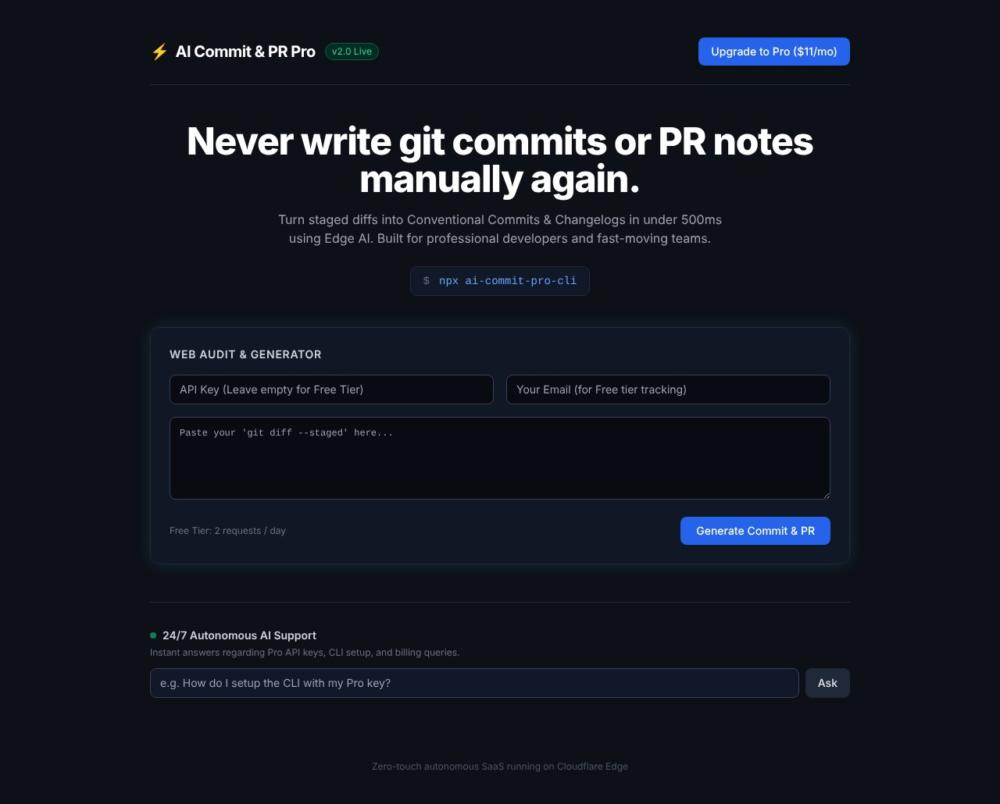

## どんなサービス？

「AI Commit & PR」は、`git diff` の内容を貼り付けるだけで、コミットメッセージとPRの要約文を作ってくれるWebツールです。コミットの規約（Conventional Commits）に沿った文を出してくれるので、`feat:` や `fix:` などの接頭辞を選ぶ迷いが減ります。

開発者の開発記には、コミット文やPR要約を毎回考えるのは地味に頭を使う作業で、それをなくしたかったと書かれています。

*画像：AI Commit & PR公式サイト（2026年10月8日に取得）*

## 使い方

開発記によると、3ステップです。

1. ターミナルで `git diff` を取得してコピーする
2. サービスの入力欄に貼り付ける
3. 生成されたコミット文とPR要約を使う

ログインなしで使え、無料枠は1日2回までです。サイトにはコマンドライン版（`npx ai-commit-pro-cli`）も案内されています。

## 料金

公式ページによると、無料枠は1日2回までで、制限なく使いたい人向けに、月額11ドルのProプランが用意されています（確認日：2026年10月8日）。最新の内容は、公式ページで確認してください。

## ここがポイント

- **規約に沿った出力。** コミット文を、チーム開発でよく使われる規約に合わせて標準化できます。
- **英語のコミット文も。** 英語での作成を標準化したい、というのも作った理由に挙げられています。
- **Cloudflareのエッジで動作。** 公式ページには「Cloudflare Edge上で動く、ゼロタッチのSaaS」と書かれています。

## リンク

- サービス: [AI Commit & PR](https://ai-commit-tool.ikeda-lef.workers.dev)
- 開発記（Qiita）: [【無料】git diff を貼るだけでConventional Commits規約のコミット文＆PR要約を作るWebツールを作った](https://qiita.com/ikedalef/items/3fc49ed859a7a839d8a9)
