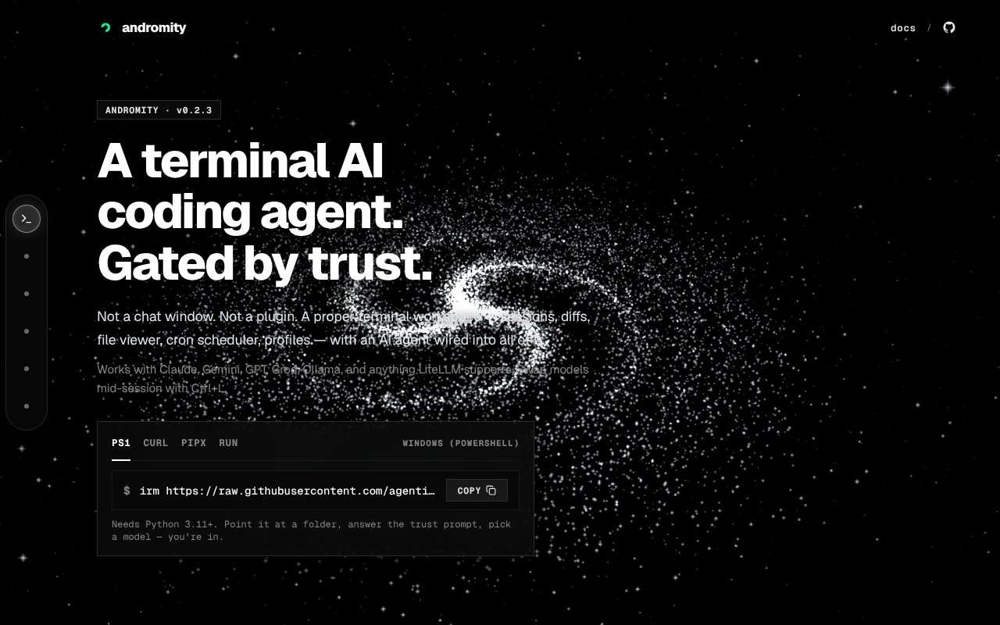

## どんなサービス？

「Andromity」は、ターミナルで動く、AIコーディングエージェントです。公式ページのキャッチコピーは、「A terminal AI coding agent. Gated by trust.（信頼で制御する）」。チャット画面でもプラグインでもなく、セッション、差分、ファイルビューア、定期実行、プロファイルを備えた、ターミナルの作業場にAIを組み込んだ形です。

オープンソース（MITライセンス）で、無料で使えます。VS Codeの拡張機能としても、ターミナルのCLIとしても動きます（バージョン0.2.3、確認日：2026年10月8日）。

*画像：Andromity公式サイト（2026年10月8日に取得）*

## 信頼のしくみ

公式ページによると、フォルダを開いたときに、Andromityは「このフォルダを信頼しますか」と聞きます。その答えが、すべてを決めます。「いいえ」なら、エージェントはファイルを書くことも、コマンドを実行することもできません。

信頼したあとは、4つの権限モードで、自由度を選べます。

- **SAFE：** 計画も、ファイルの書き込みも、コマンドも、1つずつ承認する
- **TRUST：** 計画だけ確認し、書き込みとコマンドは直接実行する
- **FULL：** 直接実行する
- **YOLO：** 無人の定期実行にも使える、最も自由なモード

## ここがポイント

- **いつでも止められることを重視。** 開発記によると、作者は、速さより「いつでも止められる」ことが大事だという考えで作りました。エージェントが確認なしにファイルを書き換えていくのが怖かった、というのがきっかけです。
- **いろいろなモデルが使える。** Claude、Gemini、GPT、Groq、Ollamaなど、LiteLLMが対応するものを使えます。セッション中にモデルを切り替えられ、Ollamaなら無料でオフラインでも動かせると書かれています。
- **便利なコマンド。** 思考の流れを見られる `/waterfall`、一発で巻き戻す `/undo`、夜間に動かす `/cron` があります。
- **自分のAPIキーを使う方式。** プライバシー重視で、APIキーを持ち込む方式です。

作者は、自分が作者であることを開示したうえで、良いところと、まだ言えないことを分けて書く、という姿勢で開発記を書いています。

## リンク

- サービス: [Andromity](https://andromity.agenticmarket.dev)
- ソースコード: [agenticmarket/andromity](https://github.com/agenticmarket/andromity)
- 開発記（Qiita）: [AIエージェントに勝手にコードを書き換えられるのが怖くて、自分で作りました【2026年9月・無料】](https://qiita.com/shekhar/items/7f890ac99ecc103de617)
