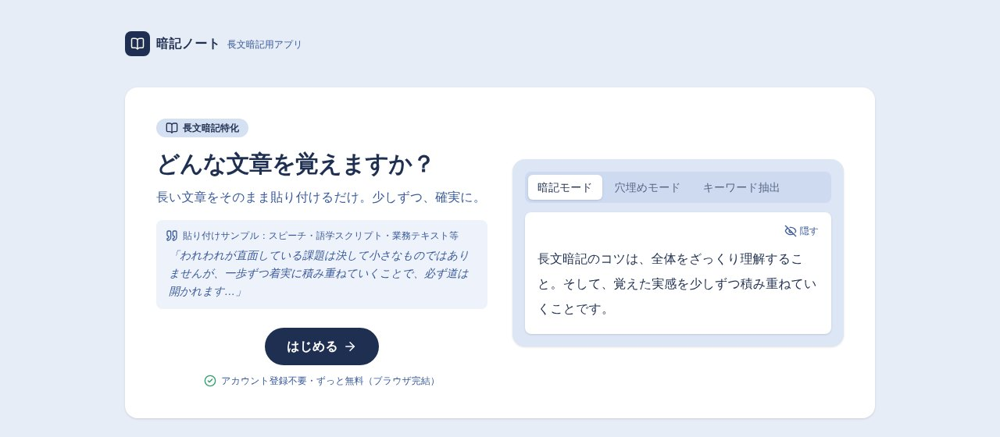
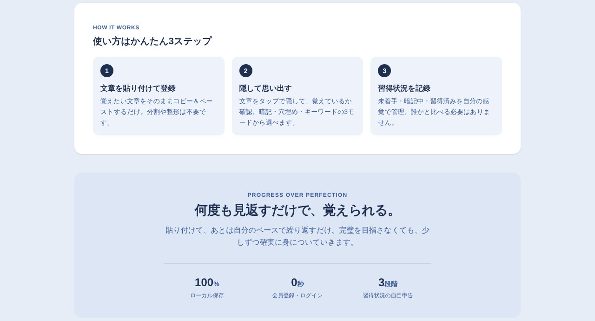

## どんなサービス？

「暗記ノート」は、覚えたい長い文章をそのまま貼り付けるだけで、暗記の練習ができるWebアプリです。単語帳のように1語ずつ登録する必要がなく、スピーチ原稿や自己紹介のような、まとまった文章を丸ごと覚えたい場面を想定しています。

公式ページによると、アカウント登録は不要でずっと無料です。データはブラウザの中に保存されます。

*画像：暗記ノート公式サイト（2026年10月7日に取得）*

## 3つの練習モード

- **暗記モード:** 文章を隠して、思い出しながら確かめる
- **穴埋めモード:** キーワードを空欄にして、タップで答え合わせをする
- **キーワードモード:** 要点だけを表示して、そこから文章を思い出す

練習したあとは、「未着手」「暗記中」「習得済み」の3段階で、自分で習熟度を記録できます。トップページでは、登録前に3つのモードのデモを試せます。

*画像：暗記ノート公式サイト（2026年10月7日に取得）*

## ここがポイント

- **貼るだけで始められる。** 文章の分割や整形は、いりません。
- **練習のしかたを選べる。** 同じ文章を、3つの見せ方で繰り返し練習できます。
- **フォルダとブックマークで整理できる。** 複数の文章を、用途ごとに分けて管理できます。

## リンク

- 開発者のX: [@kxqj5m0nGu71785](https://x.com/kxqj5m0nGu71785)
- サービス: [anki-note.vercel.app](https://anki-note.vercel.app)
- 開発記（Qiita）: [長文暗記アプリ「暗記ノート」開発記 #8 完成・振り返り編](https://qiita.com/satou_learning/items/0cdb8f9f8f65f9982c71)
- ソースコード: [GitHub](https://github.com/Satou20250828/anki-note)
