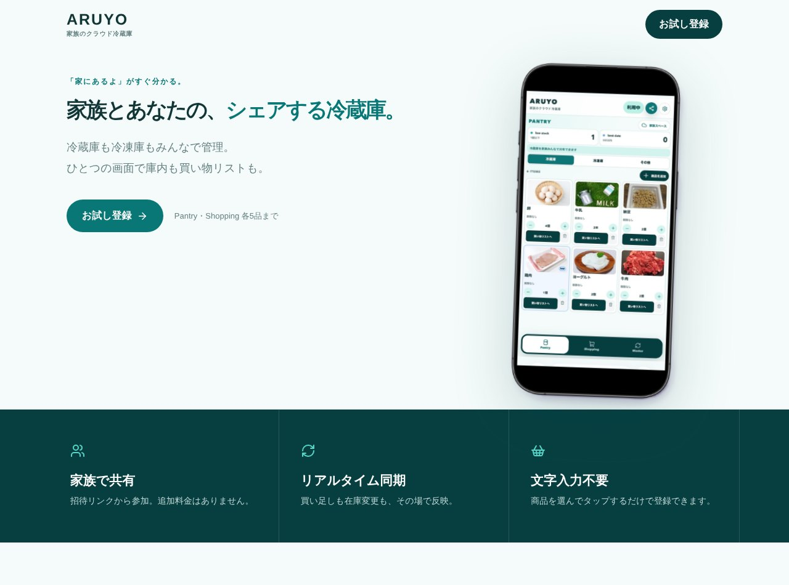

## どんなサービス？

「ARUYO」は、冷蔵庫の中身を家族で共有できる、「クラウド冷蔵庫」のWebアプリです。公式ページの言葉は、「『家にあるよ』がすぐ分かる。家族とあなたの、シェアする冷蔵庫」。冷蔵庫も冷凍庫もみんなで管理でき、ひとつの画面で庫内も買い物リストも見られます。

「牛乳、まだあったよね？」と家族に聞いても、返ってくるのは「多分」。そんな日常の小さなストレスから、作られたそうです。

*画像：ARUYO公式サイト（2026年10月8日に取得）*

## できること

公式ページと開発記によると、特徴は次のとおりです。

- **家族で共有：** 招待リンクから参加できる。更新すると、全員の画面にその場で反映される
- **文字入力不要：** 商品を選んでタップするだけで登録できる
- **3つの画面：** 在庫のPantry、買い物リストのShopping、よく使う商品のMaster
- **少なくなったものや期限が近いものを、トップのカードで確認できる**

## 料金

公式ページによると、無料プランは登録不要で、Pantryと買い物リストは各5品まで使えます。家族で共有するなら、月額300円（1世帯）の有料プランです。オーナー1人の契約で、家族全員が利用できます（確認日：2026年10月8日）。

## ここがポイント

- **自分用のアプリを家族向けに。** 開発者は以前、自分用の在庫管理アプリを作っていて、それを家族で共有できる形に作り直しました。
- **インストール不要。** スマホのブラウザでURLを開くだけで使え、PCでも見やすいレイアウトに調整されています。
- **ほかにもツールを運営。** 開発者は、非エンジニアとして、便利でおもしろいWebツールを作り続けています。

## リンク

- サービス: [ARUYO](https://aruyo.mapierre.dev/)
- 開発記（Zenn）: [【作ってみた】まだ牛乳あったっけ？家族で共有「クラウド冷蔵庫」を作った話「ARUYO」](https://zenn.dev/mapierre/articles/d0a644beac08a7)
