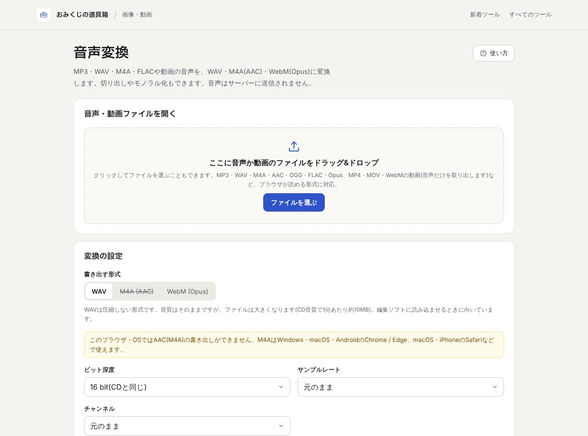

## どんなサービス？

「音声変換」は、音声ファイルや動画の音声を、別の形式に変換するWebツールです。「おみくじの道具箱」というツール集のひとつで、公式ページには「音声はサーバーに送信されません」と書かれています。無料で、登録も不要です。

MP3、WAV、M4A、AAC、OGG、FLAC、Opus、MP4やMOV、WebMの動画（音声だけを取り出す）など、ブラウザが読める形式に対応しています。

*画像：おみくじの道具箱 音声変換（2026年10月8日に取得）*

## できること

公式ページによると、次のような変換ができます。

- **書き出す形式：** WAV（16・24・32bit）、M4A（AAC）、WebM（Opus）
- **切り出し（トリミング）、モノラル化、サンプルレートの変更**

WAVは圧縮しない形式なので、音質はそのままですが、ファイルは大きくなります。編集ソフトに読み込ませるときに向いています、と説明されています。

## ここがポイント

- **ブラウザの中だけで完結。** 開発記によると、エンコードにはWebCodecsのAudioEncoderを使っています。
- **使えない形式は選べない。** AACが使えるかはOSとブラウザの組み合わせで変わるため、起動時に確かめ、使えない形式は選べなくして理由を表示します。「選べるのに失敗するUIが一番困る」という考え方です。
- **作らないと決めたものもある。** MP3の書き出しは作らない、と開発記のタイトルにも書かれています。

## リンク

- サービス: [音声変換](https://tools.omikuji.dev/audio-converter/)
- 開発記（Zenn）: [WebCodecs でブラウザ完結の音声変換を作った（AAC は OS 次第、MP3 は作らない）](https://zenn.dev/omikuji/articles/audio-converter-webcodecs-no-mp3)
