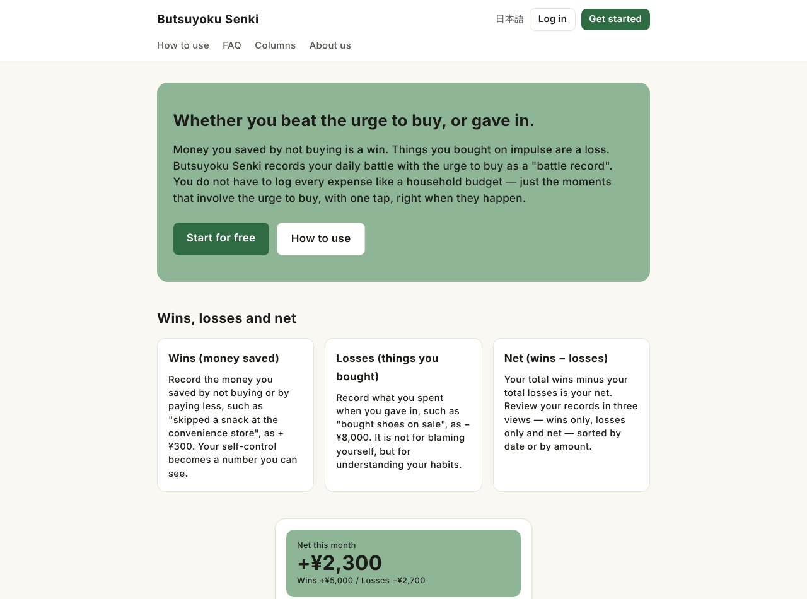

## どんなサービス？

「ブツヨク戦記」は、物欲との日々の戦いを、「戦記」として記録するサービスです。公式ページには、「物欲に勝った日（買わずに済んだ）と、負けた日（買ってしまった）を記録」とあり、家計簿のように、すべての支出を記録する必要はありません。買いたい衝動が起きた場面だけ、その場でワンタップで残します。

*画像：ブツヨク戦記公式サイト（2026年10月8日に取得）*

## 記録のしかた

公式ページによると、記録は3つの見方で整理されます。

- **勝ち：** 買わずに済んだ、安く済んだお金。たとえば「コンビニのお菓子をやめた」を、+¥300として記録する
- **負け：** 衝動に負けて買ったもの。たとえば「セールで靴を買った」を、−¥8,000として記録する。自分を責めるためではなく、習慣を知るためのもの
- **差し引き：** 勝ちの合計から負けの合計を引いた数字

記録は、家族や友達と見せ合うこともできます（開発記より）。サイトは日本語と英語に対応しています。

## ここがポイント

- **Web・iOS・Androidを1人で。** 開発記によると、API（`/api/v1`）を1本だけ作り、3つのアプリが同じものを使います。iOSとAndroidは、記事の時点では審査待ちでした。
- **表示用の文言はサーバーで作る。** 金額の表記や「今日」「昨日」の判定をサーバーが行うことで、3つの実装のずれを防いでいます。
- **設計書は1か所に。** 設計書をサーバーのリポジトリに集めて、複数のアプリの仕様をそろえています。

## リンク

- サービス: [ブツヨク戦記](https://butsuyokusenki.com)
- 開発記（Zenn）: [Web・iOS・Android を 1 つの API で作った個人開発の設計メモ【ブツヨク戦記】](https://zenn.dev/tomiengineer/articles/17312da58c6504)
