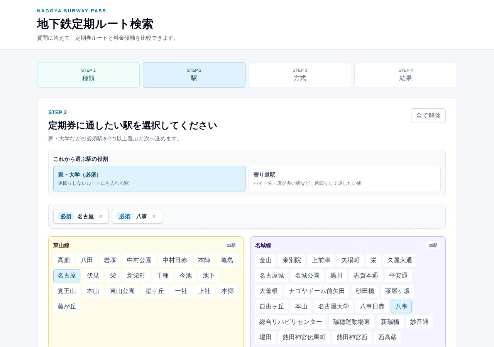
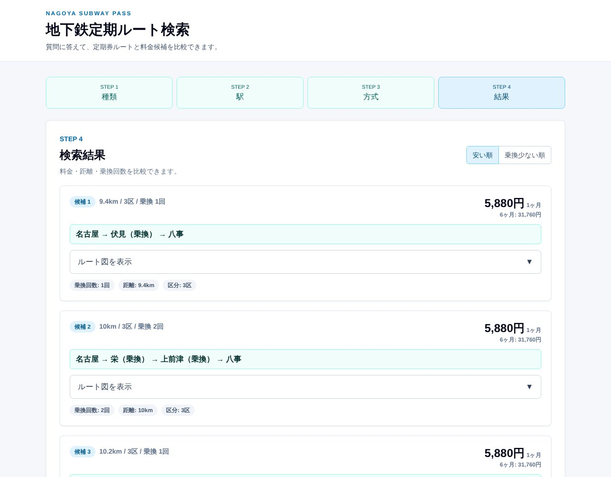

## どんなサービス？

「地下鉄定期ルート検索」は、名古屋市営地下鉄の定期券のルートと料金を、比べられるWebアプリです。通したい駅を選ぶと、それらを一筆書きでたどるルートと、定期代の候補を出してくれます。

きっかけは、開発者が大学生になって、通学の定期券を作ることになったことだそうです。名古屋市営地下鉄の定期代は距離の区分（1区〜5区）で決まり、一定の距離を超えると、それ以上は値段が上がりません。それなら、最短のルートよりも、よく使う駅を通るルートのほうが得かもしれない、という発想です。

## 使い方

画面の案内に沿って、4つのステップで進みます。

1. 定期券の種類（通勤定期、学生定期など）を選ぶ
2. 家や大学などの、必ず通る駅を2つ以上選ぶ（寄り道したい駅も追加できる）
3. 検索方式（高速／網羅）を選ぶ
4. 候補の一覧で、料金・距離・乗換回数を比べる

*画像：地下鉄定期ルート検索（2026年10月8日に取得）。画面は、名古屋と八事を選んだ例です*

*画像：地下鉄定期ルート検索の検索結果（2026年10月8日に取得）。学生定期（大学生）で、名古屋と八事を選んだ例です*

## ここがポイント

- **「安い順」「乗換が少ない順」に並べ替えられる。** 候補ごとに、ルート図で途中の駅も確認できます。
- **遠回りの得を、数字で比べられる。** 開発記では、名古屋〜八事の定期に月320円を足すと金山も通れるようになる、という例が紹介されています（学生定期の1か月の場合）。
- **定期券のルールに沿った探索。** 名古屋市交通局が定めている「一筆書きで乗換3回以内」などの条件をもとにした探索だと、開発記に書かれています。料金や発売の可否は、必ず交通局の案内で確認してください。

## リンク

- サービス: [calc-nagoya-subway.vercel.app](https://calc-nagoya-subway.vercel.app)
- ソースコード: [GitHub](https://github.com/bqron-37/calc_nagoya_subway)
- 開発記（Qiita）: [名古屋市営地下鉄の定期券なら遠回りし放題なので、ルートを探すアプリを作った](https://qiita.com/bqron-37/items/1c7c3d8897f299a73af5)
