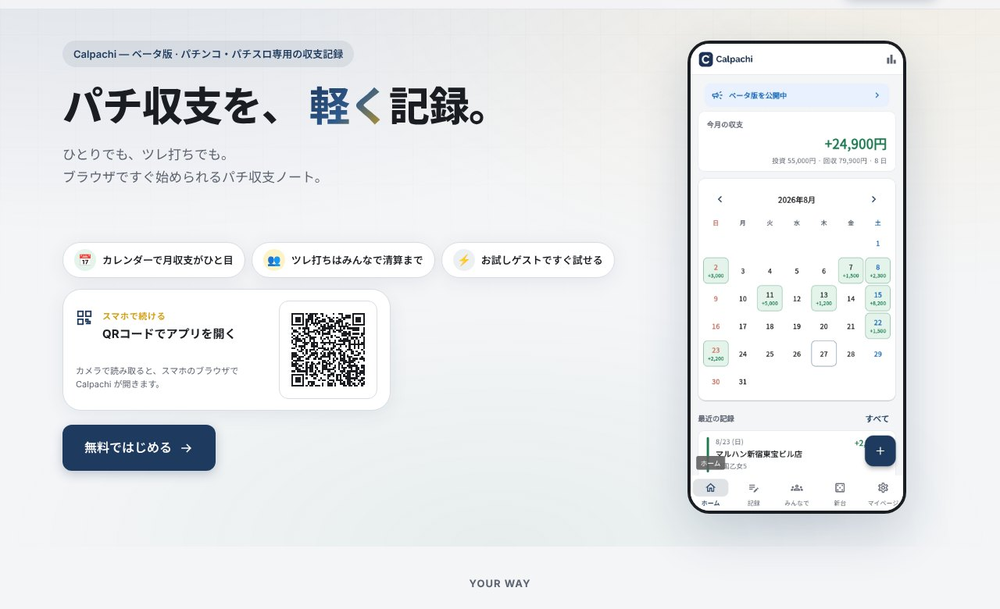

## どんなサービス？

「Calpachi」は、パチンコ・パチスロの収支を記録するための、Webアプリです。公式ページのキャッチコピーは「パチ収支を、軽く記録。ひとりでも、ツレ打ちでも」。現在はベータ版として公開されています（確認日：2026年10月8日）。

投資額と回収額を入れるだけで、日時、店舗、機種、タグもまとめて残せます。ブラウザですぐ始められ、スマホではQRコードからアプリを開けます。

*画像：Calpachi公式サイト（2026年10月8日に取得）*

## できること

公式ページには、次の機能が挙げられています。

- **カレンダーで振り返り：** 月ごとの収支を色分けして表示する
- **みんなで・清算：** ツレ打ちの日は部屋を作って収支を共有し、終わったら清算して、それぞれの記録に残す
- **多角的な集計：** 月次のサマリーと、タグ・店・機種での絞り込み、友人ごとの収支
- **クラウド同期：** Googleログインでデータを保存し、端末を替えても引き継ぐ
- **お試しゲスト：** ログインの前に、使い心地を確かめられる
- **デザインの切り替え：** ライトのほか、ネイビー×ゴールドなど複数のテーマ

## ここがポイント

- **PMが一人で作った。** 開発記によると、開発者は普段はプロジェクト／プロダクトのマネジメントを担う立場で、AIに実装を任せながら一人でアプリを公開しました。何を作るか、何をやらないかを決める部分に重点を置いた経験談です。
- **自分が最初のユーザー。** 一緒に打つ友人にもレビューに付き合ってもらいながら、使う人の動きに合わせて機能を決めたそうです。
- **推奨するアプリではない。** 開発記には、パチンコ・パチスロを推奨するものではなく、自分の成績を見つめて節度を保つためのアプリだと書かれています。

## リンク

- 開発者のX: [@karuca_dotch](https://x.com/karuca_dotch)
- サービス: [Calpachi](https://calpachi.com/)
- 開発記（Qiita）: [AI時代に感謝してPMが一人でアプリをローンチした話](https://qiita.com/karuca/items/d54c3d40a97e6cad08c2)
