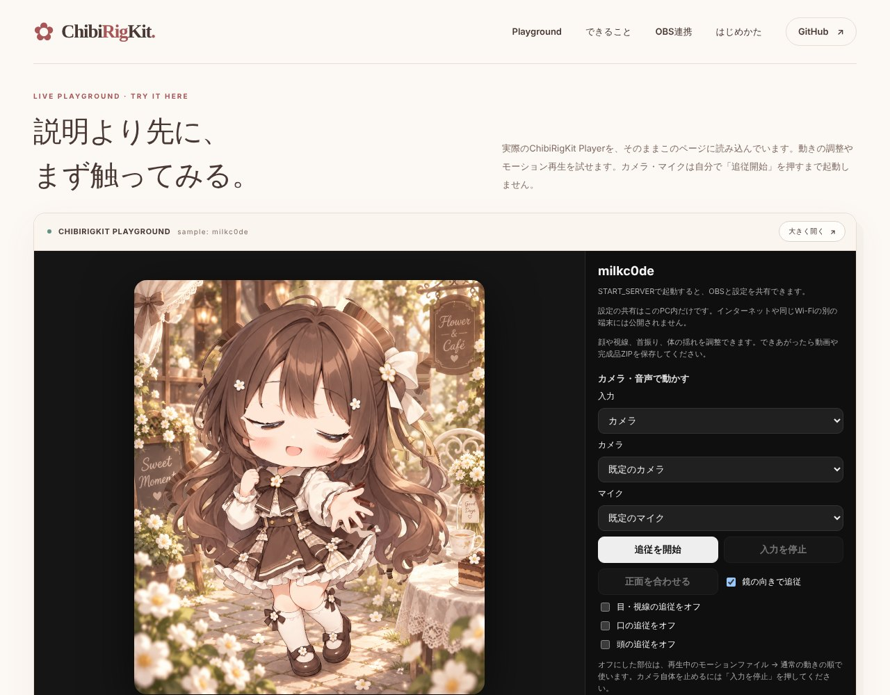
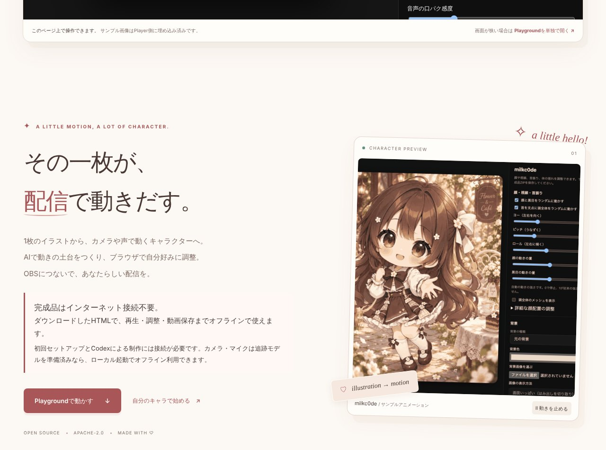

## どんなサービス？

「ChibiRigKit」は、1枚のキャラクター画像から、まばたき・視線・口パク・首振り、髪や服の揺れを持った2Dキャラクターを作るためのツールです。完成したキャラクターは、ブラウザの中で動かせて、OBSを使った配信にも映せます。

公式ページによると、ChibiRigKit はオープンソースで、ライセンスは Apache-2.0 です。

*画像：ChibiRigKit公式サイト（2026年10月7日に取得）*

## できること

- 1枚のイラストから、動かすための土台（リグ）を作る
- カメラで顔や視線、頭の向きに追従して動かす
- マイクの声に合わせて、口を動かす
- 動きを録画・保存・再生する
- OBSのブラウザソースに、動きをリアルタイムで反映する
- 完成したキャラクターは、ブラウザだけで再生・調整でき、オフラインでも使える

*画像：ChibiRigKit公式サイト（2026年10月7日に取得）*

## ここがポイント

- **まず触って確かめられる。** ページ上のプレイグラウンドで、サンプルのキャラクターをそのまま動かせます。
- **カメラとマイクの映像は保存されない。** 保存されるのは、動きを表す数値だけだと、公式ページに書かれています。
- **自分のイラストで作るには準備が必要。** リグの制作には、Python 3.12以上とCodexが必要です。再生や調整、動画の保存だけなら、ブラウザだけで足ります。

## リンク

- 開発者のX: [@milkc0de](https://x.com/milkc0de)
- サービス: [milkc0de.github.io/ChibiRigKit](https://milkc0de.github.io/ChibiRigKit/)
- ソースコード: [GitHub](https://github.com/milkc0de/ChibiRigKit)
- 開発記（Qiita）: [1枚のキャラクター画像から動く2Dキャラを作る「ChibiRigKit」を作りました](https://qiita.com/milkc0de/items/f3e2396cf5bff27cb0f3)
