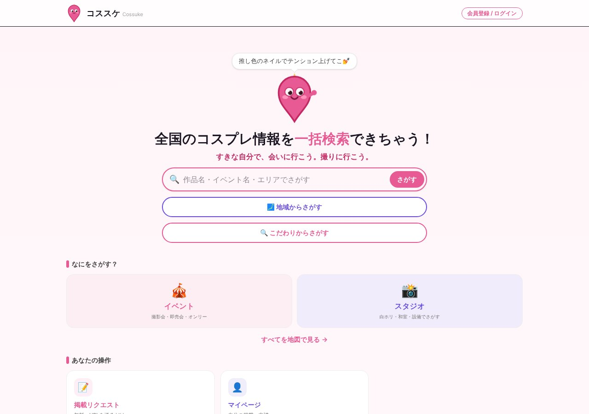

## どんなサービス？

「コススケ」は、全国のコスプレのイベントやスタジオを、一括で検索できるサービスです。トップには「全国のコスプレ情報を一括検索できちゃう！」「すきな自分で、会いに行こう。撮りに行こう。」と書かれています。

開発者は、コスプレ歴15年のレイヤーで、本業はITエンジニア。開発記では、「SNS時代のコスプレイヤーズアーカイブ」を目指したと紹介されています。

*画像：コススケ公式サイト（2026年10月8日に取得）*

## できること

- 作品名、イベント名、エリアなどで探す
- 地域から探す、こだわり（白ホリ、和室、設備など）から探す
- イベントやスタジオを地図で見る
- 掲載リクエスト（無料。URLを送るだけ）
- 無料ログインで使えるマイページ

*イベントの一覧は日々更新される情報のため、画面の掲載は最小限にしています。*

## ここがポイント

- **ルールを構造化して持つ。** 開発記によると、コスプレは二次創作なので、イベントやスタジオごとにルール（武器の長さ、血のりの可否、SNSへの掲載など）が違い、それがどこにもまとまっていない点に着目して、検索とあわせてルールを整理することを設計の中心にしたそうです。
- **無料枠で運営。** Next.jsとSupabase、Vercelなどの無料枠で動かしていると書かれています。
- **散らばった情報をまとめる。** イベントも撮影場所もSNSに散らばっているので、それを1か所で探せるようにした、というのが作った理由です。

## リンク

- サービス: [コススケ](https://cossuke.jp)
- 開発記（Zenn）: [無料で作ったコスプレ検索サービスがXで30万インプ。3日で元に戻った先の話](https://zenn.dev/mitutuki01/articles/1667c82c449b05)
