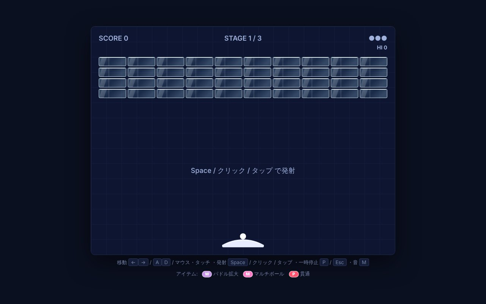

## どんなサービス？

「Crackout」は、ブラウザで遊べるブロック崩しゲームです。ブロックはガラスでできていて、ボールが当たるたびにひびが走り、最後に音を立てて砕けます。インストールは不要で、URLを開くだけで遊べます。

*画像：Crackout公式ページ（2026年10月8日に取得）*

## 遊び方

公式ページに、操作が載っています。

- **移動:** キーボードの ← → または A / D、マウス・タッチ
- **発射:** スペースキー、クリック、タップ
- **一時停止:** P または Esc
- **音:** M で切り替え

ブロックを壊すと、アイテムが出ます。パドルの拡大（W）、マルチボール（M）、貫通（P）があります。ハイスコアも記録されます。

## ここがポイント

- **ガラスの表現。** ひびの入り方と、砕ける音まで作り込まれています。
- **スマホだけで作られた。** 開発者の開発記によると、パソコンを使わず、スマホからチャットでAI（Claude Code）に指示するだけで、数時間でゲームを公開したそうです。発案は開発者、実装はClaude Codeという分担です。
- **同じ開発者の別のゲームも。** 石の代わりに花を置く「Flower Reversi」も公開されています。

## リンク

- 開発者のX: [@tinklingway](https://x.com/tinklingway)
- ゲーム: [Crackout](https://tinkling-way-games.github.io/crackout/)
- 花のリバーシ: [Flower Reversi](https://tinkling-way-games.github.io/flower-reversi/)
- 開発記（Qiita）: [リビングでゴロゴロしながら、チャットだけで数時間でゲームを公開した話](https://qiita.com/TinklingWay/items/c8532e29d8b393cb5206)
