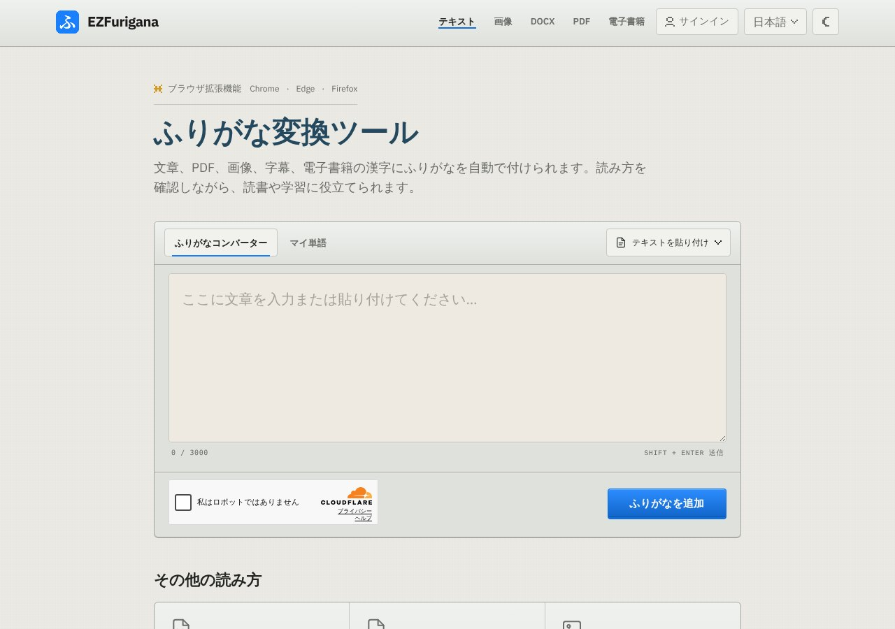

## どんなサービス？

「EZFurigana」は、日本語の文章や文書の漢字に、ふりがなを付けるオンラインツールです。公式ページには、文章、PDF、画像、字幕、電子書籍の漢字に、ふりがなを自動で付けられると書かれています。読み方を確認しながら、読書や学習に使えます。

ふりがなは、ひらがな、カタカナ、ローマ字から選べます。結果は、読んだり、編集したり、書き出したりできます。

*画像：EZFurigana公式サイト（2026年10月8日に取得）*

## できること

公式ページによると、次のものが読み込めます。

- 貼り付けた日本語の文章、TXTやSRTのファイル
- ウェブページ
- Word（DOCX）、PDF、画像（文字を読み取って付ける）、電子書籍（EPUB）
- Chrome、Edge、Firefox向けの、ブラウザ拡張機能（閲覧中に読みを追加）

「マイ単語」の画面もあり、自分の用語の読み方を登録できます。サインインの欄がありますが、貼り付けた文章は、そのまま試せます。

## ここがポイント

- **文脈で読みを決める。** 開発記によると、「市場」は文脈で「いちば」とも「しじょう」とも読みます。そこで、Sudachiで解析し、辞書とルールで判断できるものは処理して、決められない単語だけ、軽量なModernBERTの分類器に渡す設計にしたそうです。
- **AIを使いすぎない。** 文章全体を大きな言語モデルに投げず、あいまいな部分だけに使うことで、速度とコストを抑えています。
- **読み方を確認できる。** 他の読み方の候補を見て、自分で直せます。

## リンク

- サービス: [EZFurigana](https://ezfurigana.com/jp)
- 開発記（Zenn）: [「市場」は“いちば”か“しじょう”か？ 文脈まで読むふりがな生成ツールを作った](https://zenn.dev/ez_furigana/articles/4f0ba4bded76c2)
