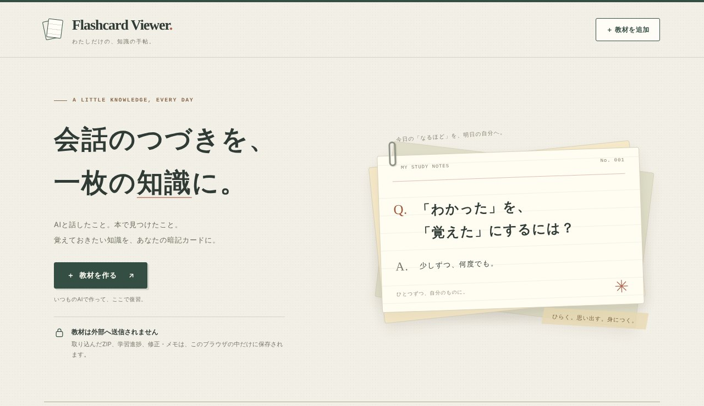
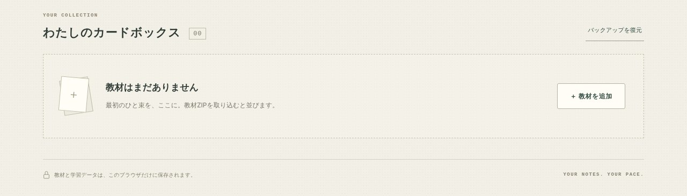

## どんなサービス？

「Flashcard Viewer」は、AIとの会話で学んだことを、暗記カードにして復習するためのブラウザアプリです。トップには「会話のつづきを、一枚の知識に。」と書かれています。

AIに「この会話で質問した英語表現を教材にしてください」のように頼んで、教材のZIPファイルを作ってもらい、それをViewerに取り込むと、すぐに学習を始められます。

*画像：Flashcard Viewer公式サイト（2026年10月8日に取得）*

## できること

開発記によると、次のような機能があります。

- カードは「一問一答」と「穴埋め」の2種類
- カードごとに、「もう一度」「微妙」「覚えた」で覚え具合を記録
- 用語検索、セクションや進捗による絞り込み、前回の続きから再開
- 問題や答えの修正、カードごとの自分用メモ

*画像：Flashcard Viewer公式サイト（2026年10月8日に取得）*

## ここがポイント

- **教材を作る側と見る側を分けた。** 教材は `Flashcard Package v1` というZIPの形式で、中身はmanifest.jsonとcards.jsonです。将来は別のツールからも教材を作れる設計です。
- **AIが形式を間違えたら。** エラーの内容と正式な形式を含む「修正依頼プロンプト」をコピーして、AIに直してもらえます。
- **データはブラウザの中。** バックエンドは持たず、教材も進捗もIndexedDBに保存します。公式ページにも「教材と学習データは、このブラウザだけに保存されます」とあります。
- **あえて入れなかった機能。** アカウント、クラウド同期、複雑な学習アルゴリズム、共有機能は、最初から入れていないそうです。

## リンク

- サービス: [Flashcard Viewer](https://flashcard-viewer.atoook.com/)
- 開発記（Qiita）: [AI時代のインプットを「わかった」で終わらせないために、flashcard-viewerを作った](https://qiita.com/atok/items/df0ff03ee1f703a36870)
