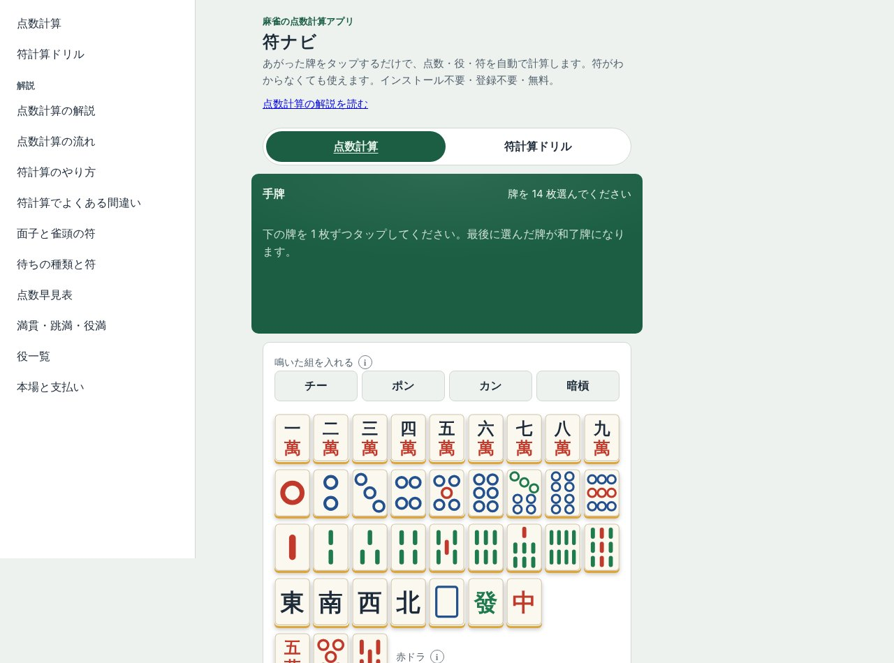

## どんなサービス？

「符ナビ」は、麻雀の点数計算と符計算のためのWebアプリです。公式ページには、「あがった牌をタップするだけで、点数・役・符を自動で計算します。符がわからなくても使えます。インストール不要・登録不要・無料」と書かれています。

*画像：符ナビ公式サイト（2026年10月8日に取得）*

## 使い方

公式ページには、次のように案内されています。

1. あがった手の牌を、上の一覧から順にタップする（最後にタップした牌があがり牌になる）。鳴いた組は、ポンやチーを押してから牌を選ぶ
2. ツモかロン、場風・自風、リーチなどを選び、ドラ表示牌があれば入れる
3. 手牌がそろうと、点数が自動で表示され、符の内訳も見られる

「符計算ドリル」や、点数計算の流れ、符計算のやり方、よくある間違い、点数早見表などの解説も、サイトに用意されています。

## ここがポイント

- **ほぼAIが書いた。** 開発記によると、Claude Codeに作らせ、最初のコミットから独自ドメインでの公開まで約20時間（公開日2026年9月30日時点の記述）。自動テストは1,087本あります。
- **AIに任せる前に仕組みを用意。** 完了の定義をCLAUDE.mdに書くなど、リポジトリ側にルールを整えてから任せたそうです。
- **サーバー代は0円。** フレームワークを使わず、GitHub Pagesで公開しています。

## リンク

- サービス: [符ナビ](https://fu-koro.com/mahjong-fu-calculator/)
- 開発記（Zenn）: [Claude Code（Opus 5.5）で麻雀点数計算アプリを20時間で公開した。先に用意した5つの仕組み](https://zenn.dev/fukorohouse/articles/127839090d6c25)
