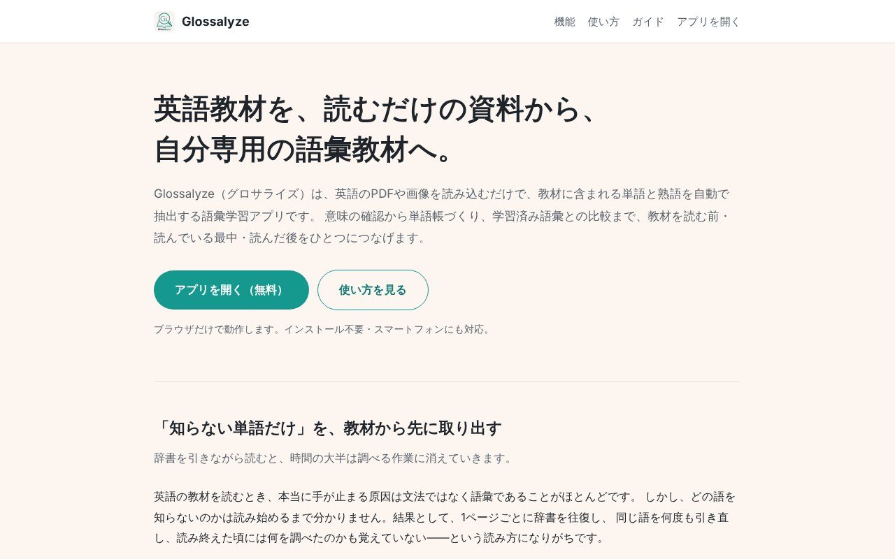

## どんなサービス？

「Glossalyze」は、英語のPDFや画像を読み込むだけで、教材に含まれる単語と熟語を自動で抽出してくれる、語彙学習アプリです。公式ページには、「英語教材を、読むだけの資料から、自分専用の語彙教材へ」と書かれています。ブラウザだけで動き、インストール不要で、スマホにも対応しています（無料、確認日：2026年10月8日）。

*画像：Glossalyze公式サイト（2026年10月8日に取得）*

## できること

公式ページには、次の機能が並んでいます。

- **PDF・画像から語彙を自動抽出：** PDFを読み込むか、プリントや参考書をカメラで撮影する。複数ページもまとめて取り込める
- **単語だけでなく熟語も：** 句動詞やイディオムも抽出する
- **日本語の意味をその場で確認：** 辞書アプリに移動せずに確認できる
- **自分だけの単語帳：** 気になった語を単語帳に入れ、フォルダで整理できる
- **学習済み語彙との比較：** 最初に語彙レベルを設定すると、自分にとっての未知語だけが浮かび上がる

Web版で読み込めるのは、画像（最大10MB）とPDF（最大50MB）です（開発記より）。

## ここがポイント

- **読む前に、知らない語を押さえる。** 辞書を引きながら読むと、時間の大半が調べる作業に消えます。順番を入れ替えて、先に未知語だけを確認してから本文を読めるようにしています。
- **市販の単語帳との違い。** 市販の単語帳は収録語が固定ですが、自分が使っている教材と、自分のレベルに合った単語帳を作れます。
- **レベルの基準。** 語彙レベルは、CEFR-Jの語を基準に設定します。

## リンク

- サービス: [Glossalyze](https://glossalyze.sawa0911a.workers.dev/)
- 開発記（Zenn）: [英語教材のPDFや写真から単語・熟語を自動抽出する学習アプリを作った](https://zenn.dev/nsawada/articles/glossalyze-vocab-learning-app)
