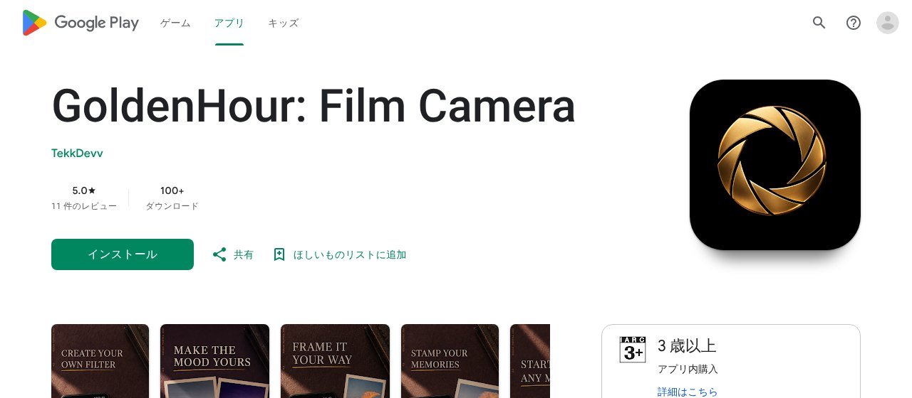

## どんなサービス？

「GoldenHour」は、スマホのカメラで撮った写真に、フィルム写真のような色合いと粒子感を重ねる、Androidのカメラアプリです。スマホのカメラは、明るく失敗の少ない写真が撮れる反面、階調が平らになり、陰影や温かみが失われる、と感じていた開発者が、個人で作りました。

Google Playのストアページでは、「ヴィンテージのフィルムカメラと写真の編集アプリ。自分だけのフィルターとレトロなフレームを作れます」と紹介されています。

*画像：Google Playのストアページ（2026年10月8日に取得）*

## 主な特徴

開発者の開発記によると、次のような特徴があります。

- **50種類以上のフィルムシミュレーション。** 開発者の挙げる例は、Fuji Pacific 78（鮮やかなターコイズブルーと黄金色のハイライト）、Fuji Astia Pastel（人物の肌色を美しく見せる、柔らかい階調）、Y2K Cyber Flash（2000年代初めのコンパクトデジカメのフラッシュ）などです。
- **レシート風のプリント。** 撮影日時や露出の情報、バーコードを重ねた、感熱紙のようなレイアウトです。
- **判子と切手のフレーム。** 和紙の台紙に縦書きと赤い判子を合成するレイアウトや、切手のようなフレームが選べます。
- **撮影後に待たされにくい作り。** 現像の処理を、最適化しているとのことです。プレビューと保存した画像で、見た目が一致するようにしています。

## ここがポイント

- **「撮って、そのまま作品になる」。** フィルターをかけるだけでなく、紙に焼いたような見た目まで含めて、写真を楽しめるのが特徴です。
- **フィードバックを募集中。** 開発者は、操作感やフィルムの色の再現度について、意見を求めています。

## リンク

- サービス（Google Play）: [GoldenHour: Film Camera](https://play.google.com/store/apps/details?id=com.goldenhour.filmcamapp)
- 開発記（Qiita）: [【個人開発】スマホの過度なHDR補正が苦手で、本物のフィルム色感を再現するカメラアプリをFlutterで作った話](https://qiita.com/shivaT/items/f1d2c5fe0ad93a3bf343)
