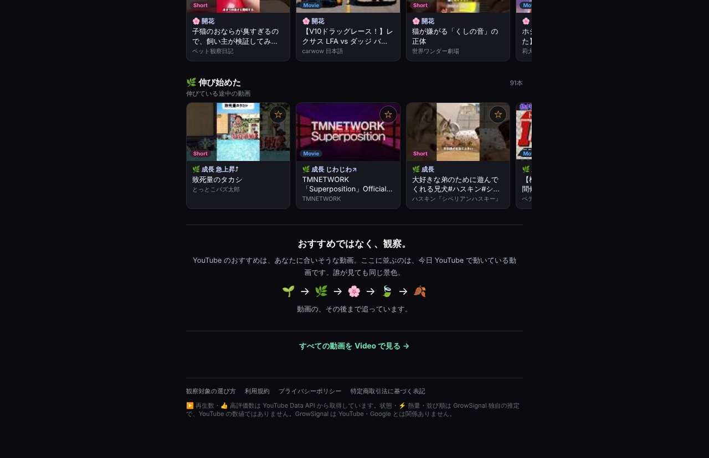

## どんなサービス？

「GrowSignal Video」は、日本のYouTubeで、いま人気が上がってきている動画を、自動で観察して見せるサイトです。キャッチコピーは「YouTubeの鼓動を、観察する。」です。

公式ページによると、人気が上がってきた動画を3時間ごとに観察し、その後の動きまで追っています。動画は、再生数の順位ではなく、🌱や🌸などの「生き物のような状態」で表示されます。

*画像：GrowSignal Video公式サイト（2026年10月8日に取得）*

## 何が見られる？

- **Today:** 今日、動いている動画。「いま動いている」「開花している」「伸び始めた」などのグループに分かれて並ぶ
- **Video:** 個別の動画の状態
- **Live:** ライブ配信
- **Watch:** ☆を押した動画の、その後を追う

*画像：GrowSignal Video公式サイト（2026年10月8日に取得）*

## ここがポイント

- **独自の推定である点が明記されている。** 状態、熱量、並び順は、再生数と高評価数からGrowSignalが計算した独自の推定で、YouTubeの数値ではないと、公式ページに書かれています。
- **作った理由が身近。** 開発者は、子どもがYouTubeをずっと見ているのに、自分は何を見ればいいか分からない、という体験から作ったと、開発記で書いています。
- **数字の読み方を工夫。** 1日の波のある再生数から、動画ごとの状態を判定するしくみの工夫が、開発記で詳しく解説されています。

## リンク

- 開発者のX: [@GrowSignal](https://x.com/GrowSignal)
- サービス: [video.growsignal.io](https://video.growsignal.io)
- 開発記（Qiita）: [動画を「順位」ではなく「生き物の状態」で見る ― YouTube の鼓動を観察するサイトを作った](https://qiita.com/growsignal/items/c2e495d75d466aa527b6)
