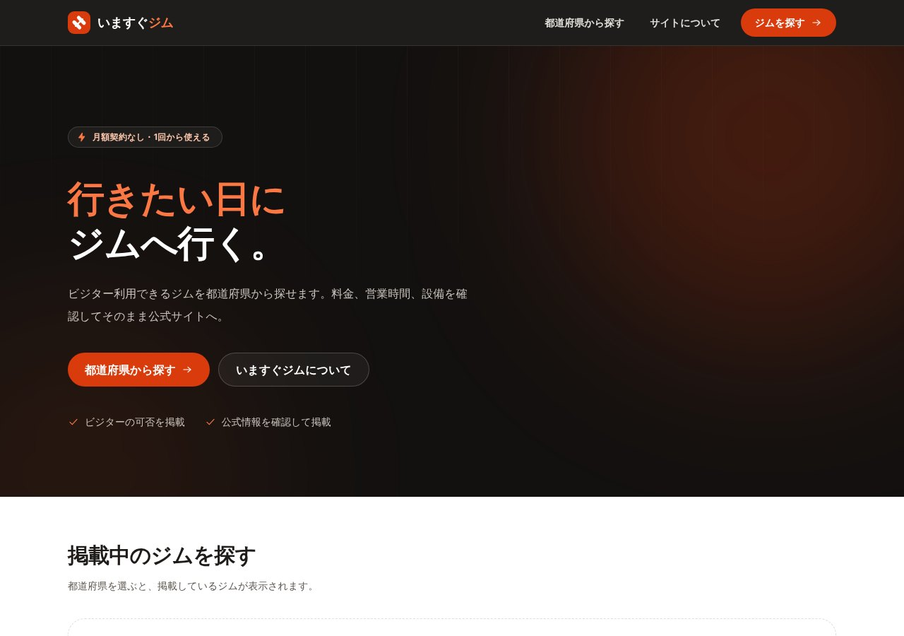

## どんなサービス？

「いますぐジム」は、月額会員にならなくても使える、ビジター利用OKのジムを探せる情報サイトです。トップには「行きたい日に、ジムへ行く。」と書かれています。出張や旅行先でも、都道府県を選べば探せます。

*画像：いますぐジム公式サイト（2026年10月8日に取得）*

## 載っている情報

公式ページによると、施設ごとに次のような情報をまとめています。

- ビジター利用ができるかどうか
- 1回あたりや、時間無制限の料金
- 曜日ごとの営業時間、定休日
- ダンベルやパワーラックなどの設備
- 予約や初回講習が必要かどうか、利用条件

サイトには、利用前に各施設の公式情報を確認するよう案内があります。掲載エリアは順次広げている、とのことです。

## ここがポイント

- **「今から行けるか」で選べる。** 月額契約の有無ではなく、今日このあと使えるかどうかを判断できる情報にまとめています。
- **公式の情報を確認して掲載。** 掲載する情報は、公式の情報を確認したものだと説明されています。
- **無料枠で動く構成。** 開発記によると、AstroとCloudflare Workers、Tursoを使い、無料枠に収まる前提で作られています。

## リンク

- サービス: [いますぐジム](https://gym-now.nozeon.workers.dev)
- 開発記（Zenn）: [いますぐジムというビジター向けのジム情報サイトを作りました](https://zenn.dev/nozeon/articles/gym-now-architecture)
