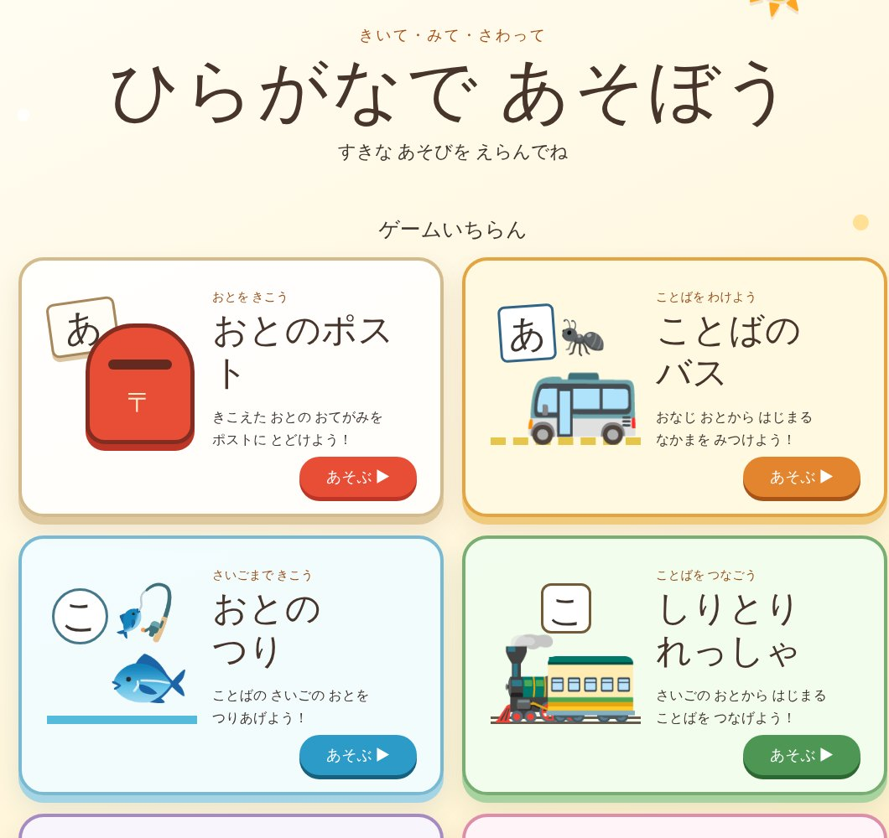

## どんなサービス？

「ひらがなで あそぼう」は、ひらがなを覚えはじめの子ども向けの、Webゲーム集です。来年小学生になる甥っ子のために作られました。開発記には、「勉強しなさい」と言わなくても、遊んでいたら少しずつ文字や音に慣れていた、くらいのものを作りたかった、と書かれています。

画面は、ひらがなを中心にした大きなボタンで作られていて、遊びたいゲームを選ぶだけです。

*画像：ひらがなで あそぼう（2026年10月8日に取得）*

## 7つのゲーム

開発記と公式ページによると、次のゲームが用意されています。

- おとのポスト：聞こえた音の手紙を、ポストに届ける
- ことばのバス：同じ音から始まる仲間を見つける
- おとのつり：ことばの最後の音を、つりあげる
- しりとりれっしゃ：最後の音から始まることばをつなげる
- もじのへんしん：ひとつの文字を変えて、ことばを変身させる
- おとのステップ：ことばの音を、ひとつずつ順番にたどる
- がっこうへいこう！：5つの文字ミッションで、教室をめざす

## ここがポイント

- **「あ」を押すだけのクイズにしない。** 開発記によると、音を聞いてその文字を押すだけではなく、ことばの最初や最後の音、音の数に注目できるゲームにしたそうです。
- **まずチャットで試作した。** 最初はChatGPTの画面で試作し、思ったより遊べたので、Codexで作り直したと書かれています。
- **大人と一緒に遊べる。** 画面に「おうちの ひとと いっしょに あそんでね」とあります。音声には、VOICEVOX:四国めたんが使われています。

同じ開発者は、九九を練習するゲームも公開しています。

## リンク

- サービス: [ひらがなで あそぼう](https://moharamo.github.io/hiragana-learning-games/)
- 開発記（Qiita）: [【Codexで学習ゲーム #1｜ひらがな編】ひらがなをまだ読めない甥っ子のために学習ゲームを作った](https://qiita.com/moharamo/items/407c057bb315d59da8af)
