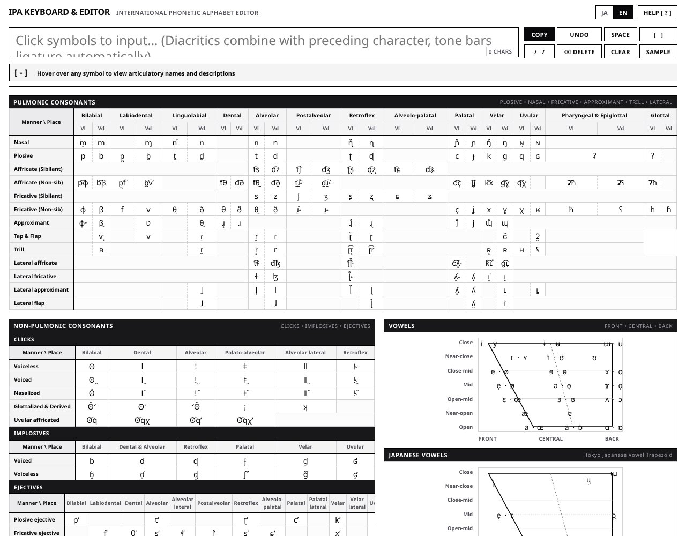

## どんなサービス？

「IPA入力 国際音声字母エディタ」は、国際音声字母（IPA）を、ブラウザの上で入力するためのWebアプリです。大学で言語学や音声学を学ぶ開発者が、講義やレポートで日常的にIPAを打つ必要があって、作りました。

画面には、IPAの表（肺気流子音、非肺気流子音、母音、補助記号など）が並び、記号をクリックすると、上の入力欄に入ります。PCでもスマホでも、インストール不要です。日本語と英語に切り替えられます。

*画像：IPA入力 国際音声字母エディタ（2026年10月8日に取得）*

## できること

画面と開発記によると、次のような機能があります。

- 記号にカーソルを合わせると、調音の名称や説明が見られる
- 結合文字（補助記号）は、直前の文字と組み合わせて入力できる
- コピー、元に戻す、スペース、削除、全消去
- サンプルの入力

## ここがポイント

- **文字崩れとの戦い。** IPAには、合字や結合文字など、普通の文字入力で表示が崩れやすい記号があります。開発記には、その対策が書かれています。
- **339個のボタンを軽く動かす。** ボタンが多いため、イベントを親でまとめて受け取る仕組み（イベント委譲）で軽く動かしている、と書かれています。
- **学びながら作った。** 開発者は、プログラミングの専門ではない大学生で、AIにコードを書いてもらいながら、その内容を1行ずつ読み解いて勉強したそうです。学習記録は、Zennのスクラップにも残されています。
- **ソースコードは公開。**

## リンク

- サービス: [IPA入力 国際音声字母エディタ](https://okawawaka.github.io/ipa-editor/)
- ソースコード: [okawawaka/ipa-editor](https://github.com/okawawaka/ipa-editor)
- 開発記（Zenn）: [国際音声字母（IPA）を入力できるWebアプリを作った話 〜合字崩れ/イベント委譲/字母辞書制作〜](https://zenn.dev/okawawaka/articles/ipa-editor-web-app)
