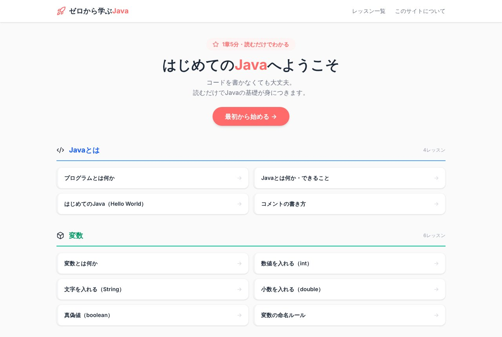
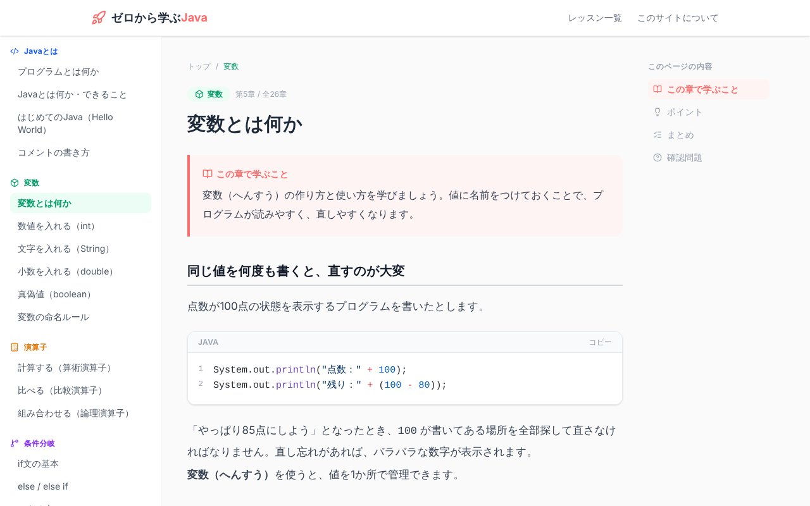

## どんなサービス？

「ゼロから学ぶJava」は、プログラミング初心者のための、Javaの学習サイトです。サイトのトップには「コードを書かなくても大丈夫。読むだけでJavaの基礎が身につきます」と書かれています。コードを書く前に、「これは何のためのものか」を知ることを大切にした作りです。

*画像：ゼロから学ぶJava公式サイト（2026年10月8日に取得）*

## 学べる内容

全7章、26レッスンで、Javaの基本を順番にたどれます。サイトには「1章5分・読むだけでわかる」とあります。

1. Javaとは（プログラムとは何か、Hello World、コメント）
2. 変数（int、String、double、boolean、命名ルール）
3. 演算子（算術・比較・論理）
4. 条件分岐（if、else / else if、switch）
5. 配列・繰り返し（配列、for、while、break / continue）
6. メソッド（引数、戻り値）
7. クラスとオブジェクト（クラス、インスタンス、フィールドとメソッド）

*画像：ゼロから学ぶJava公式サイトのレッスンページ（2026年10月8日に取得）*

## ここがポイント

- **理屈から入れる。** 先に「何をするものか」「なぜ必要か」を読んでから、コードを見る順番です。
- **スマホで読みやすい。** 通勤中などの短い時間に、少しずつ進められるように作ったと、開発者は書いています。
- **親しみやすい見た目。** 「難しそう」ではなく「これなら読めそう」と思ってもらえるデザインを目指したとのことです。

## リンク

- サービス: [java.happy-engineer.com](https://java.happy-engineer.com/)
- 開発記（Qiita）: [初心者向けJava学習サイトを作りました。～作ったきっかけとコンセプト編～](https://qiita.com/masaki-engineer/items/5b5c56e7e5a8289b61a1)
