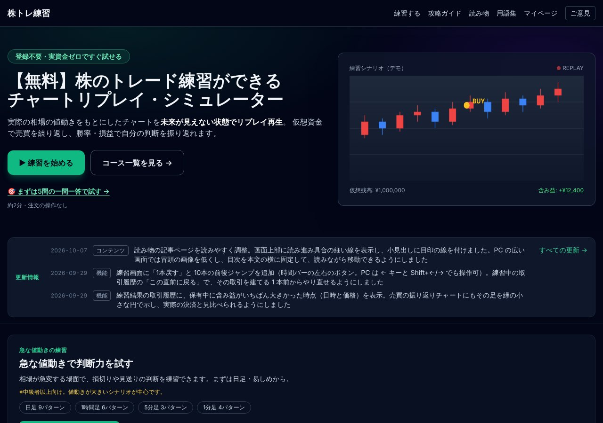

## どんなサービス？

「株トレ練習」は、株のトレードを、仮想資金で練習できるWebアプリです。公式ページには、「実際の相場の値動きをもとにしたチャートを、未来が見えない状態でリプレイ再生。仮想資金で売買を繰り返し、勝率・損益で自分の判断を振り返れます」と書かれています。登録不要で、実資金ゼロですぐ試せます。

教育目的のシミュレーションで、投資助言や特定の銘柄の推奨は行っていない、と開発記に明記されています。

*画像：株トレ練習公式サイト（2026年10月8日に取得）*

## できること

- チャートを先が見えない状態でリプレイし、仮想資金（画面では100万円）で売買する
- 勝率と損益で、自分の判断を振り返る
- 急な値動きの場面を想定した、シナリオでの練習
- 約2分で試せる、5問の一問一答
- 攻略ガイド、読み物、用語集

練習画面には、1本戻す、10本ずつ前後にジャンプするなど、リプレイを操作する機能が追加されています（サイトの更新情報より）。

## ここがポイント

- **ゲストでも練習できる。** 会員登録は必須ではなく、チャートのリプレイと仮想売買は、ゲストのままで使えます。保存などの処理だけ、ログインが必要です。
- **小さく、低コストで運用。** Next.jsとSupabase、Vercelにまとめた構成で、開発記に設計の工夫が書かれています。
- **更新情報を公開。** トップページに、改善の履歴が日付つきで載っています。

投資にはリスクがあります。練習の結果は、実際の成績を保証するものではありません。

## リンク

- サービス: [株トレ練習](https://www.kabu-renshu.com)
- 開発記（Zenn）: [Next.js 14 + Supabaseで株のチャートリプレイ練習アプリを個人開発した構成](https://zenn.dev/devtoolbox/articles/06dac561b49f08)
