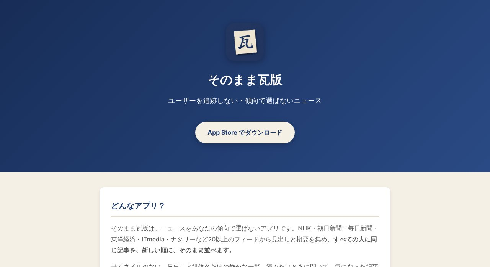
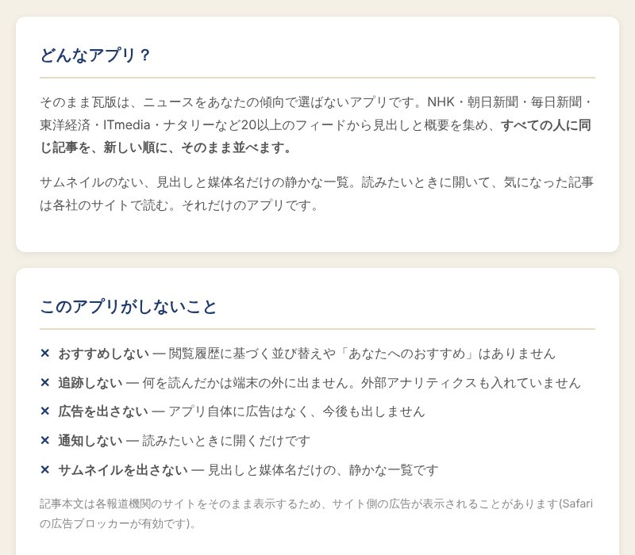

## どんなサービス？

「そのまま瓦版」は、ユーザーの傾向でニュースを選ばない、iOSアプリです。NHK、朝日新聞、毎日新聞、東洋経済、ITmediaなど20以上のフィードから見出しと概要を集め、すべての人に同じ記事を、新しい順に、そのまま並べます。

サムネイルのない、見出しと媒体名だけの静かな一覧。読みたいときに開いて、気になった記事は各社のサイトで読む、というシンプルなアプリです。

*画像：そのまま瓦版 公式サイト（2026年10月8日に取得）*

## しないことを、決めたアプリ

公式ページには、このアプリが「しないこと」が並んでいます。

- おすすめしない：閲覧履歴に基づく並び替えや「あなたへのおすすめ」はない
- 追跡しない：何を読んだかは端末の外に出ない。外部のアナリティクスも入れていない
- 広告を出さない：アプリ自体に広告はない
- 通知しない：読みたいときに開くだけ
- サムネイルを出さない

*画像：そのまま瓦版 公式サイト（2026年10月8日に取得）*

## できるのは「除くこと」だけ

見たくないものは、自分で決めて取り除けます。

- カテゴリ除外（無料で2つまで）：たとえば「芸能」と「スポーツ」を消す
- キーワードミュート：特定の人名や話題を、部分一致で消す
- 媒体の非表示：見たくない媒体をまるごと消す

除外した件数は設定画面で数字として見えるので、フィルタが効いていることを確かめられます。

## ここがポイント

- **カテゴリは配信元のものを使う。** アプリが記事の中身を解析して分類するのではなく、各媒体が配信しているカテゴリ別のRSSを使っていると、開発記に書かれています。
- **フィードの読み込みは自作。** RSS 2.0、RDF、Atomの3形式に対応し、実際のフィード21本をテスト用に保存して確かめているそうです。
- **料金。** 公式ページによると、基本機能はすべて無料です。

## リンク

- サービス: [そのまま瓦版](https://kankan.one/kawaraban/)
- 開発記（Qiita）: [おすすめしない・追跡しないニュースアプリを作った話](https://qiita.com/taka96k/items/efd9bb427269468acfc7)
