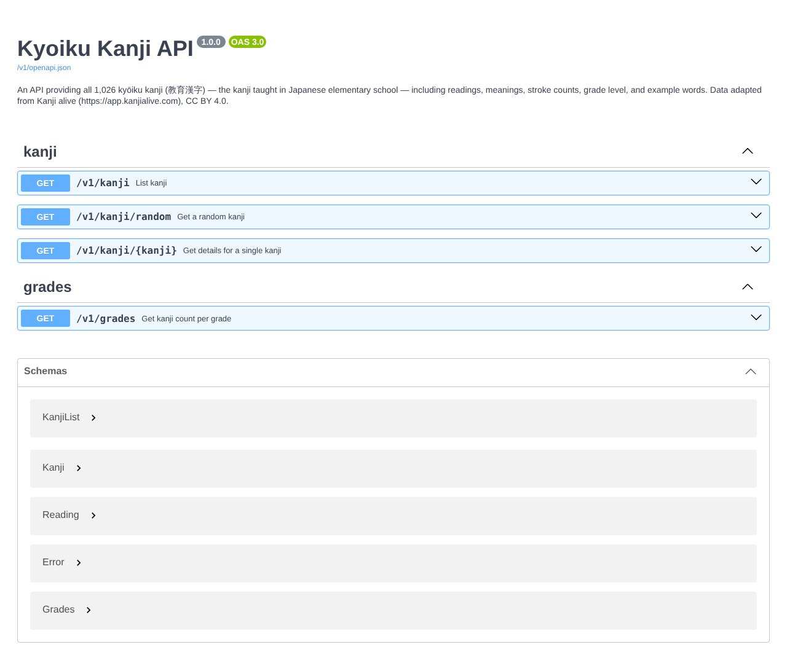

## どんなサービス？

「Kyoiku Kanji API」は、小学校で習う教育漢字1,026字の情報を返す、公開APIです。読み、意味、画数、学年、用例の単語が、JSONで取れます。

公式ページはAPIの仕様書（Swagger UI）になっていて、そのまま試せます。漢字を使った学習アプリや、ゲームを作りたい人向けの部品です。

*画像：Kyoiku Kanji API公式サイト（2026年10月8日に取得）*

## できること

開発記と仕様書によると、用意されているのは次の4つです。

- `GET /v1/kanji`：漢字の一覧
- `GET /v1/kanji/random`：ランダムな1字
- `GET /v1/kanji/{kanji}`：単字の詳細
- `GET /v1/grades`：学年ごとの字数

一覧には、学年、画数の範囲、漢字・意味・読みの部分一致で絞り込めます。訓読みと音読みは、日本語表記とローマ字の両方を配列で持っています。

## ここがポイント

- **仕様書から作っている。** zod-openapiでルートの定義からOpenAPIの仕様を生成していて、仕様書と実装がずれにくい作りです。
- **ローカルでも試せる。** Cloudflare D1のローカルDB（SQLite）を使うので、手元で開発やテストができます。
- **データの出典が明記されている。** 漢字のデータは、Kanji aliveが公開しているもの（CC BY 4.0）を元にしている、と開発記に書かれています。

## リンク

- サービス: [Kyoiku Kanji API](https://api.kyoiku-kanji.st-man.com)
- 開発記（Qiita）: [教育漢字（小学校で習う1026字）特化のAPIを開発・公開した](https://qiita.com/st-man-hori/items/2dceda8e319e26f41792)
