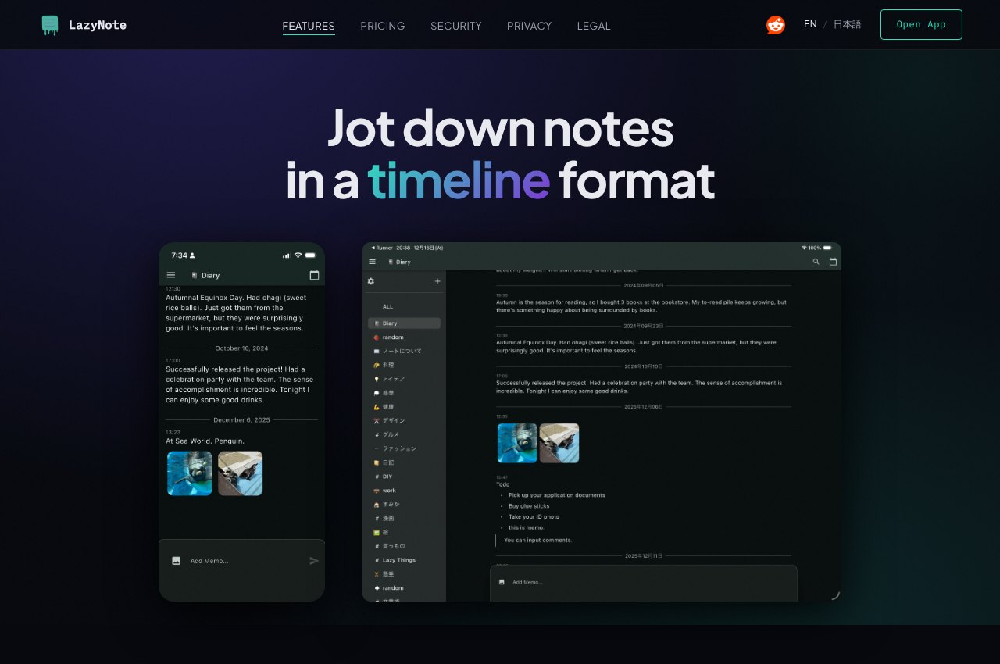

## どんなサービス？

「LazyNote」は、タイムライン形式のメモアプリです。公式ページには、「Discordがメモのために作られたら、こうなる」と書かれています。チャットのように、思いついたことを次々と書き込み、時系列でさかのぼって見返せます。

開発者は、Discordの個人サーバーをメモ帳として、2〜3年使っていました。そこで気づいた良さを形にしたのが、LazyNoteです。リリースまでには3年かかった、と開発記に書かれています。

*画像：LazyNote公式サイト（2026年10月8日に取得）*

## 3つの特徴

公式ページが挙げている、3つの特徴です。

- **タイムライン形式：** すばやくメモを入力し、時系列で見返せる
- **リアルタイム同期：** 複数の端末やプラットフォームで、数秒以内に同期する。スマホで書いて、Webで続きができる
- **エンドツーエンド暗号化：** パスワードでメモの内容が暗号化され、プライベートに保てる

iOSアプリ（App Store）と、Webアプリで使えます。料金は、公式ページのPRICINGで確認できます。

## ここがポイント

- **Discordのメモ用途から生まれた。** 開発記では、どのデバイスでも瞬時に同期される、多機能すぎない、タイムラインで見られる、という3つが、メモにDiscordを使う利点として挙げられています。
- **構造化しすぎない。** フォルダ分けなどの高度な構造化は、使う人にとってプレッシャーになる。だから、チャンネルを分ける程度の、軽い整理にとどめる考え方です。
- **日本語にも対応。** 公式ページは、英語と日本語を切り替えられます。

## リンク

- サービス: [LazyNote](https://about.lazynote.app/)
- 開発記（Zenn）: [DiscordっぽいUIのメモアプリを開発しました ~LazyNote~](https://zenn.dev/tp113/articles/2777da1eef8806)
