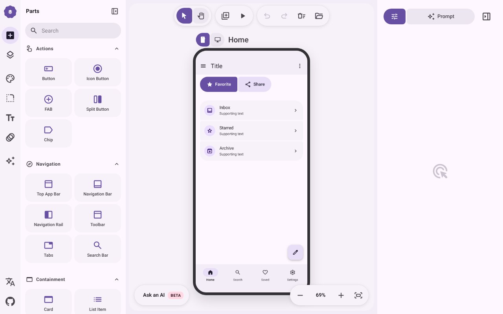

## どんなサービス？

「M3E Canvas」は、スマホの画面をブラウザの上で組み立てると、その内容をAIに渡すプロンプトにしてくれるツールです。Material 3 Expressive（Googleのデザインの考え方）の部品を、ドラッグ＆ドロップで並べていきます。

AIにアプリを作らせると、どこかで見た画面になりがちです。それは、色や角丸、余白などを毎回AIが思いつきで決めるから、というのが開発者の考えです。「Material 3 Expressiveで」と指定すれば見た目の判断を減らせますが、どの画面に何を置くかを文章で説明するのは大変。そこで、画面を組んだ結果を、そのまま文章にするツールを作ったそうです。

*画像：M3E Canvas公式サイト（2026年10月8日に取得）*

## できること

開発記によると、主な機能は次のとおりです。

- Material 3 Expressiveの部品を、ドラッグ＆ドロップで配置する
- ボタンやリスト項目を近づけると、磁石のようにくっついてグループになる
- スマホの画面を何枚でも追加し、ボタンに画面遷移を設定できる
- 組み上がった画面が、そのままプロンプトになり、コピーして使える

## ここがポイント

- **見た目の判断をAIから減らす。** デザインの決まりごとを指定することで、AIが毎回見た目を発明しなくてよくなる、という考え方です。
- **ソースコードは公開。** GitHubでソースが公開されています。
- **きっかけはXの投稿。** 「Material 3 Expressiveを使ってと頼むだけで、Googleっぽいおしゃれなデザインになる」という投稿が反響を呼び、そのときに作ったツールを紹介した、と書かれています。

## リンク

- サービス: [M3E Canvas](https://lnkiai.github.io/m3e-canvas/)
- ソースコード: [lnkiai/m3e-canvas](https://github.com/lnkiai/m3e-canvas)
- 開発記（Zenn）: [UIを描いたらプロンプトになるツールを作った](https://zenn.dev/lnkiai/articles/fef5d8e52368cc)
