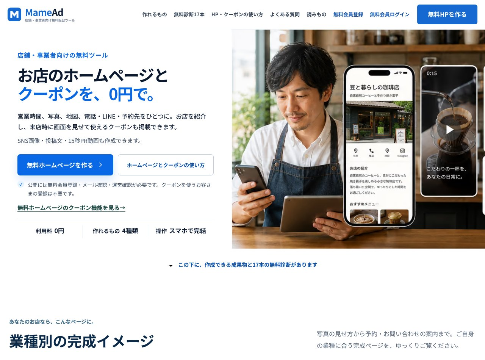

## どんなサービス？

「MameAd（マメアド）」は、飲食店や美容サロン、ジムなど、小さなお店や個人事業主のための、店舗案内ページの作成ツールです。公式ページのキャッチコピーは、「お店のホームページとクーポンを、0円で」。営業時間、写真、地図、電話・LINE・予約先を、ひとつのページにまとめます。

利用料は0円で、操作はスマホで完結します（確認日：2026年10月8日）。公開には、無料の会員登録とメール確認、運営の確認が必要です。クーポンを使うお客さまの登録は不要です。

*画像：MameAd公式サイト（2026年10月8日に取得）*

## できること

公式ページによると、次のようなことができます。

- 業種を選んで、店名、営業時間、住所、写真、予約のURLなどを入力する
- 来店時に画面を見せて使える、クーポンを掲載する
- SNS用の画像、投稿文、15秒のPR動画を作る
- 無料の診断（17本）で、お店の状態を確かめる

飲食店、学習塾、美容室、ジム、小売店、宿泊、工務店、不動産などの業種別に、完成イメージも見られます。

## ここがポイント

- **あえて自由度を捨てた。** 開発記によると、グリッドや配置の自由を全部なくし、入力するとそのまま案内先として使えるページになる、テンプレート型にしました。日中ワンオペで忙しい個人店のオーナーにとって、白紙のキャンバスは負担になる、という考えです。
- **情報は1枚に集約。** 地図、営業時間、SNS、クーポン、予約先を、1ページにまとめます。
- **受託開発の経験から。** 開発者は、受託開発や業務システムの構築を88件ほど手がけてきたエンジニアだと、開発記で自己紹介しています。

## リンク

- サービス: [MameAd](https://mamead.mameoffice.com/)
- 開発記（Zenn）: [【個人開発】受託88件こなしたエンジニアが、個人店向けに「自由度を捨てた」完全無料の店舗案内ページツールを作った](https://zenn.dev/mameoffice/articles/0c3963cf46a287)
