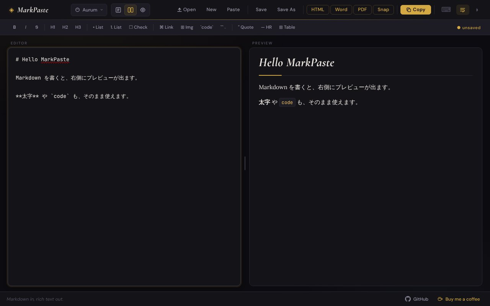

## どんなサービス？

「MarkPaste」は、Markdownで書いた文章を、Wordやメール、チャットにそのまま貼れる形でコピーできる、ブラウザ上のエディタです。左で書くと、右にプレビューが出ます。

*画像：MarkPaste公式サイトの画面。入力した文章は、紹介のための例です（2026年10月7日に取得）*

## 何が便利？

AIの回答などをコピーすると、手元に来るのはMarkdownの記号つきの文章です。MarkPasteで「Copy」を押すと、見出しや表などの書式を保ったまま、クリップボードにコピーされます。開発者の開発記によると、書式つきのHTMLと、プレーンテキストの両方がコピーされるため、貼り付け先を選びません。

- **書き出し:** HTML、Word、PDF に書き出せる
- **ツールバー:** 見出し、リスト、チェックリスト、リンク、画像、コード、引用、表を、ボタンで入れられる
- **テーマ:** 見た目のテーマを切り替えられる
- **コードの色付け:** 複数のプログラミング言語に対応している

## ここがポイント

- **インストール不要。** ブラウザで開くだけです。開発記によると、ソフトを入れられない職場でも使えるように、HTMLファイル1枚で動く形も作られています。
- **作りがシンプル。** 素のHTML・CSS・JavaScriptと、Markdownの変換ライブラリ（markdown-it）だけで作られていると、開発記に書かれています。

## リンク

- 開発者のX: [@swenyun](https://x.com/swenyun)
- サービス: [markpaste.com](https://markpaste.com)
- ソースコード: [GitHub](https://github.com/tokicode/markpaste)
- 開発記（Qiita）: [インストール禁止の客先で Markdown を書くために、HTML を1枚だけ作った](https://qiita.com/tokicode/items/01397cecf44ebbc0cbcf)
