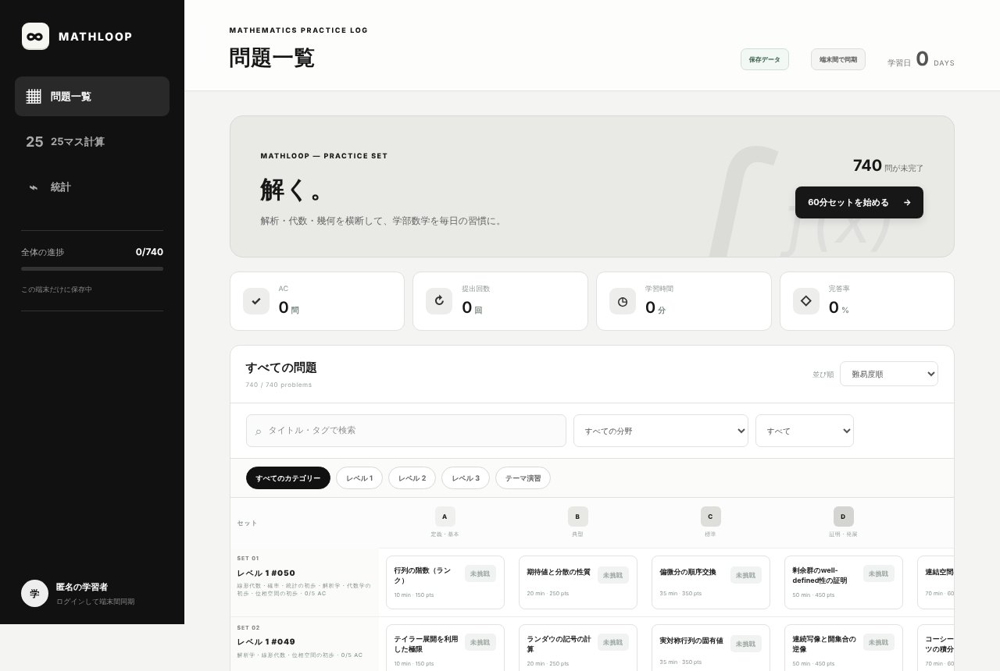
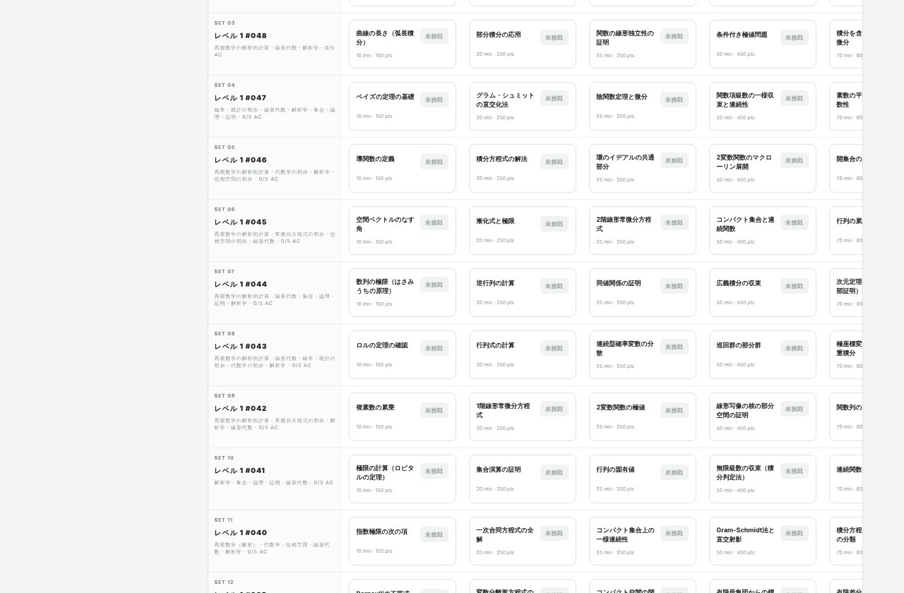

## どんなサービス？

「MathLoop」は、大学の数学を、問題を解いて提出し、採点してもらえる演習アプリです。「解析・代数・幾何を横断して、学部数学を毎日の習慣に」というのが、公式ページのコンセプトです。

開発者は数学科の3年生で、競技プログラミングのAtCoderでは1,000問以上を解いているのに、大学数学では演習量が足りない、と感じていたそうです。「大学数学にも、AtCoderのようなサイトがあればいい」と考えて作りました。

*画像：MathLoop公式サイト（2026年10月8日に取得）*

## できること

- **問題一覧:** 分野（微積分、線形代数、確率・統計、代数学、位相など）や難易度で、問題を探せる
- **採点:** 求値問題は、完全一致で採点する。記述問題は、ログインしていないときはキーワードの一致で、ログインしているときはAIで採点する
- **60分セット:** 60分の時間内に、A〜Eの5問を解くモード。未回答の問題から、ランダムに出る
- **テーマ演習:** 5問で1つの大問になる形式の演習（固有値からジョルダン標準形を求める問題など）
- **統計:** 解いた問題数や、正答率などを確認できる

ログインしないときは、記録がこの端末だけに保存されます。ログインすると、端末間で同期できます。

*画像：MathLoop公式サイト（2026年10月8日に取得）*

## ここがポイント

- **AIが記述問題を採点する。** 証明のような記述問題の採点に、さくらのAI Engineを使っていると、開発記に書かれています。最初は、TeXの書き方が少し違うだけで不正解になっていたため、採点のプロンプトを直したそうです。
- **問題は、AIが作った。** 演習問題は、ChatGPTとGeminiに作ってもらったと、開発記に書かれています。内容は、ご自身で確かめながら使ってください。
- **注意点。** 個人で使う目的で作った簡易な構成のため、ログイン用のメールは、1時間に2回までしか送れず、混み合うとログインできないことがあると、開発記に書かれています。

## リンク

- 開発者のX: [@AZBY__azby](https://x.com/AZBY__azby)
- サービス: [MathLoop](https://azubiwa.github.io/math-loop/)
- 開発記（Qiita）: [AIに数学採点させる！さくらのAI Engineで自動採点できる数学演習アプリを作った](https://qiita.com/azubiwa/items/b8ab8457b7c9ecc05018)
