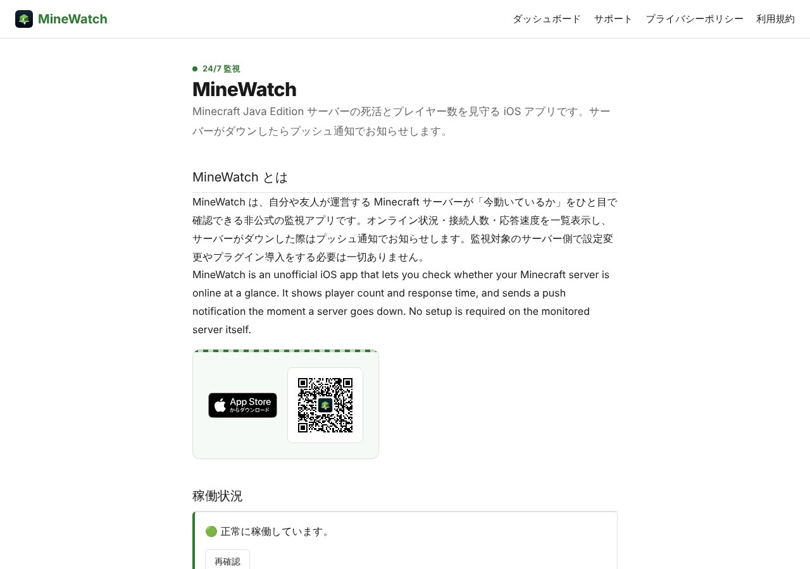
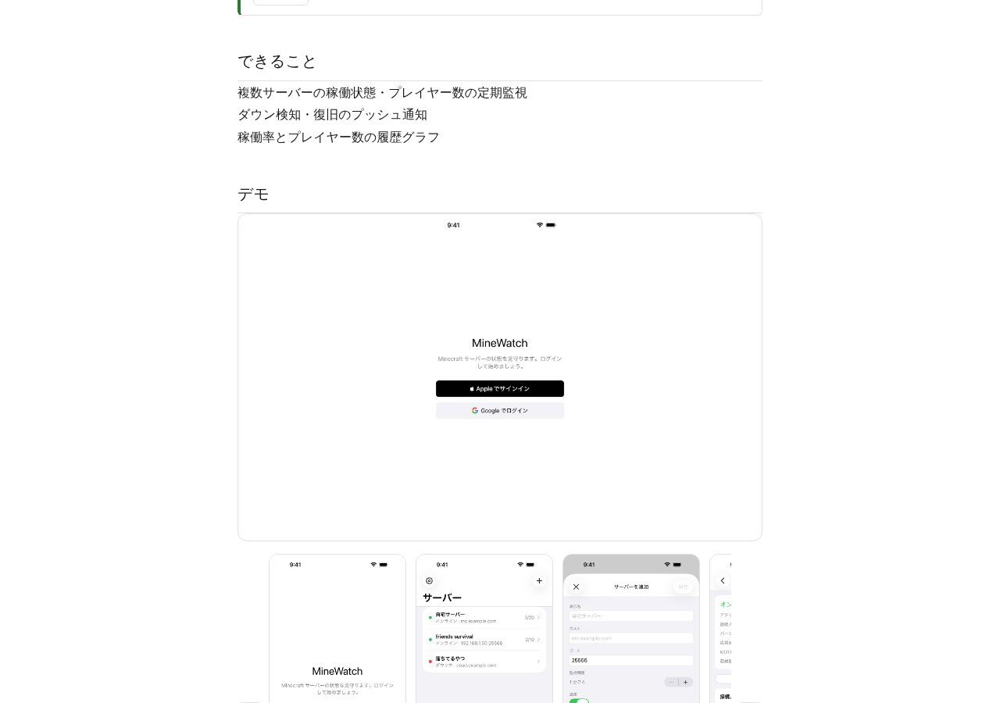

## どんなサービス？

「MineWatch」は、Minecraft Java Editionのサーバーが今動いているかを、ひと目で確認できる非公式の監視アプリです。オンライン状況、接続人数、応答速度を表示します。

自分でサーバーを運営している人や、友人と遊ぶサーバーを預かっている人が、サーバーが落ちたことにすぐ気づけるようにする、というのが目的です。公式ページによると、監視する側のサーバーに、設定の変更やプラグインの導入は必要ありません。

*画像：MineWatch公式サイト（2026年10月8日に取得）*

## できること

- 複数のサーバーの、稼働状態とプレイヤー数を、定期的に監視する
- 応答速度を表示する
- サーバーのダウンと復旧を、プッシュ通知で知らせる
- 稼働率とプレイヤー数を、履歴のグラフで確認する
- RCONに対応したサーバーへ、コマンドを送り、実行の履歴を確認する（バージョン1.2.0で追加）
- 通知のオンオフと、通知しない時間帯を、サーバーごとに設定する

iOSアプリのほか、ブラウザから状態の確認と通知設定ができるWebダッシュボードもあります。サインインは、AppleアカウントとGoogleアカウントに対応しています。

*画像：MineWatch公式サイト（2026年10月8日に取得）*

## ここがポイント

- **「見るだけ」から「操作できる」へ。** 当初は読み取り専用の監視アプリでしたが、RCONでのコマンド送信を追加しました。開発者の開発記には、安全のために、接続情報の暗号化保存、実行前の確認、実行履歴の記録、パスワードを画面にもログにも出さない作り、を最初に決めたと書かれています。
- **実行の記録が残る。** 誰が、いつ、何を実行したかを、1件ずつ残す設計です。
- **非公式のアプリ。** Minecraftの公式のものではないことが、公式ページに明記されています。

## リンク

- 開発者のX: [@jqit_yukiono](https://x.com/jqit_yukiono)
- サービス: [minewatch.sk4869.info](https://minewatch.sk4869.info/)
- 開発記（Qiita）: [「見るだけ」から「操作できる」へ ― MinecraftサーバーへのRCON実行を、個人開発でどう安全に作ったか](https://qiita.com/jqit-yukiono/items/1bf18c5f749d05d8c2ff)
