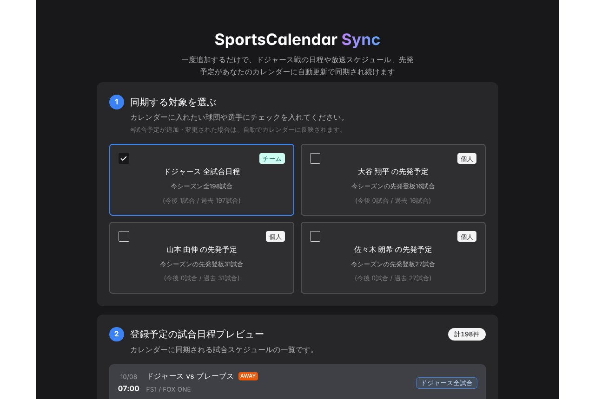
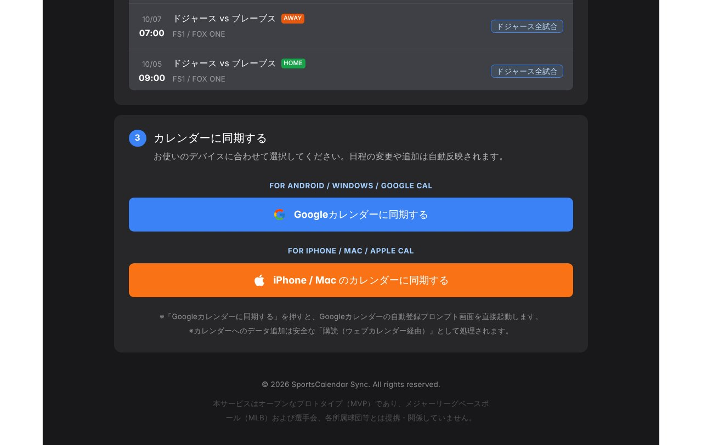

## どんなサービス？

「SportsCalendar Sync」は、MLBの試合日程を、普段使っているカレンダーに自動で同期してくれるWebアプリです。一度登録すると、試合日程の追加や変更が、カレンダーに自動で反映され続けます。

きっかけは、開発者がドジャースの試合に夢中になり、試合の開始時間や大谷選手の先発日を、毎日検索して確かめるのが手間だったことです。既存のスポーツアプリでは、カレンダー連携に対応していなかったり、特定の選手の先発日だけに絞れなかったりしたため、自分で作ったそうです。

*画像：SportsCalendar Sync公式サイト（2026年10月8日に取得）*

## 同期できるもの

- **ドジャースの全試合:** 試合日程と放送情報（公式ページでは、対戦相手、HOME/AWAY、放送局が表示されます）
- **先発予定:** 大谷翔平、山本由伸、佐々木朗希（ドジャース所属の日本人投手）のうち、選んだ選手の先発予定だけ

対応するカレンダーは、Googleカレンダーと、Appleカレンダー（iPhone / Mac）です。

## 使い方

1. 同期したい対象を選ぶ（複数は同時に選べないので、対象ごとに1つずつ登録する）
2. 試合日程のプレビューで、カレンダーに入る内容を確認する
3. 使っているカレンダーに合わせて、同期を始める

*画像：SportsCalendar Sync公式サイトの日程プレビュー（2026年10月8日に取得）*

## ここがポイント

- **一度入れれば、あとは自動。** 日程の変更や追加が、手作業なしでカレンダーに反映されます。
- **選手を絞れる。** 「大谷選手の先発日だけ」のような絞り込みができます。
- **注意点。** Googleカレンダーのスマホアプリは、URLからのカレンダー追加に対応していないため、Googleカレンダーに追加するときは、PCのブラウザから操作する、と開発記に書かれています。

## リンク

- 開発者のX: [@takahiro_tech77](https://x.com/takahiro_tech77)
- サービス: [SportsCalendar Sync](https://sports-calendar-sync-9d780.web.app)
- 開発記（Qiita）: [【個人開発】MLBの試合日程をGoogleカレンダー・Appleカレンダーに自動同期するWebアプリを作りました](https://qiita.com/takahiro_honda/items/b44d4e2b526aa009f822)
