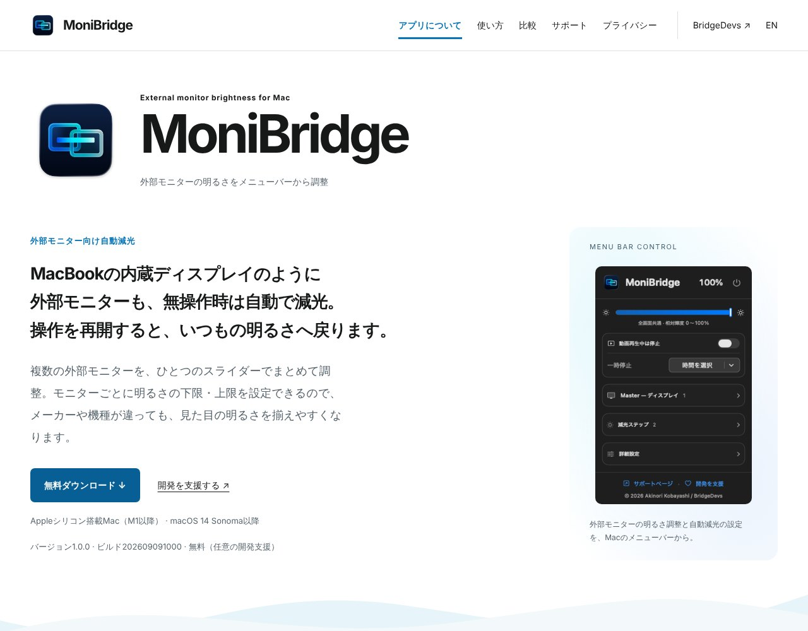

## どんなサービス？

「MoniBridge」は、Macの外部モニターの明るさを、メニューバーから調整できるアプリです。操作していない時間に合わせて、段階的に暗くし、操作を再開すると、すぐに元の明るさに戻ります。

公式ページには、「MacBookの内蔵ディスプレイのように、外部モニターも、無操作時は自動で減光」と書かれています。バージョン1.0.0で、無料でダウンロードできます（任意の開発支援あり）。確認日は、2026年10月8日です。

*画像：MoniBridge公式サイト（2026年10月8日に取得）*

## できること

公式ページと開発記によると、次のような機能があります。

- **自動減光：** 操作していない時間に合わせて、段階的に暗くする。たとえば、3分で70%、10分で40%、20分で20%という設定例が示されています（時間と割合は変更できる）
- **すぐに元の明るさへ：** マウスやキーボードの操作を検知すると、普段の明るさに戻る
- **複数のモニターをまとめて調整：** 1つのスライダーで調整でき、モニターごとに明るさの下限・上限も決められる
- **フェード、一時停止、ショートカット操作**

動作環境は、Appleシリコン搭載Mac（M1以降）、macOS 14 Sonoma以降です。Intel Macでは動きません。外部モニターの明るさを本体の設定で調整するには、DDC/CIに対応したモニターが必要です。

## ここがポイント

- **きっかけはOLEDの焼き付き。** 使っていない時間の画面の負荷を減らしたい、というところから作り始めたそうです。ただし、焼き付き防止や消費電力の削減は、保証も測定もしていないと、開発記に明記されています。
- **小さな道具。** Dockに常に置くのではなく、必要なときにメニューバーから触る道具を目指しています。
- **Swiftで作られている。** SwiftUIとAppKit、外部モニターの制御にDDCを使っています。

## リンク

- サービス: [MoniBridge](https://bridgedevs.com/ja/monibridge/)
- 開発記（Zenn）: [Macの画面を、使っていないときだけ暗くする。MoniBridgeをSwiftで作った話](https://zenn.dev/akimacdev/articles/b39b7140996d56)
