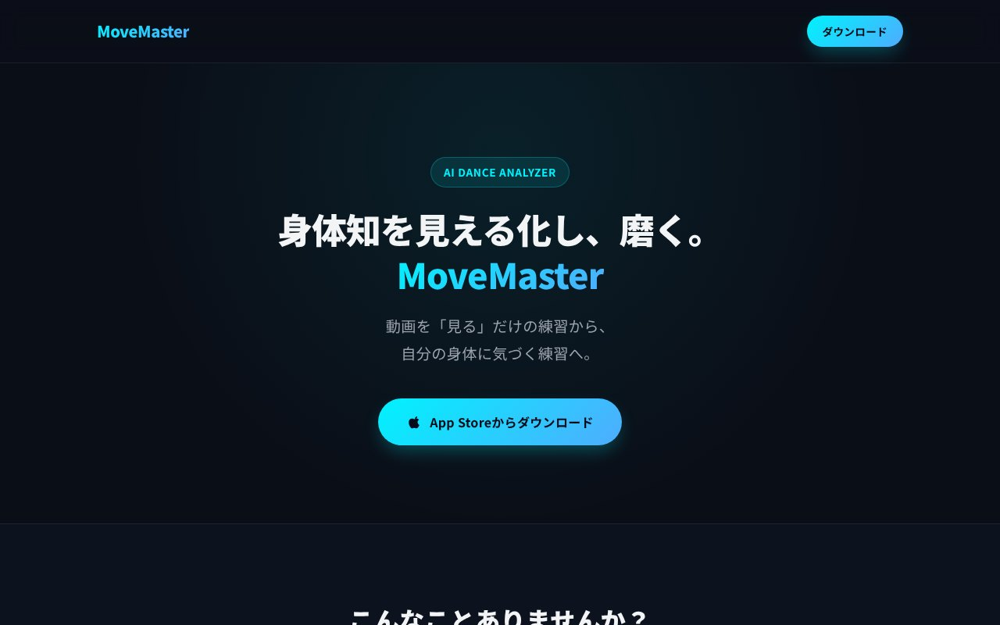
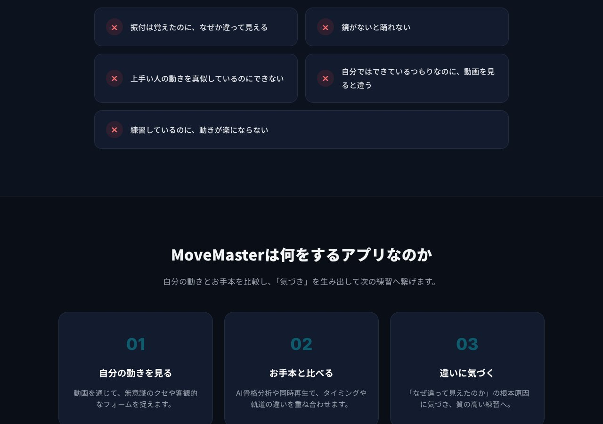

## どんなサービス？

「MoveMaster」は、ダンスの練習動画を使って、お手本と自分の動きを比べるための、iOSアプリです。公式ページには、「身体知を見える化し、磨く」「動画を『見る』だけの練習から、自分の身体に気づく練習へ」と書かれています。

「先生と同じように踊っているつもりなのに、なんか違う」「動画を見返しても、どこが違うのか分からない」という、練習熱心な人ほどぶつかる悩みを、具体的に見えるようにしたい、というのが作った理由だそうです。

*画像：MoveMaster公式サイト（2026年10月8日に取得）*

## できること

開発者の開発記によると、次のようなことができます。

- お手本と自分の動きを、比べる
- スロー再生、左右反転、コマ送り
- 骨格の表示
- 動きの軌跡を見る
- 身体の軸や、重心の状態を確認する
- 気づいたことを、動画の上に直接書き込む

*画像：MoveMaster公式サイト（2026年10月8日に取得）*

## ここがポイント

- **最初は、もっと単純なアプリだった。** 動画を再生して、スローや反転で見るところから始まり、「骨格を出したら面白いのでは」「軌跡や軸も見たい」と、機能が増えていったそうです。
- **60歳から始めた個人開発。** 開発者は、AIに相談しながら、Flutterでアプリを作り、2026年8月4日にApp Storeで公開しました。
- **ストアで入手できる。** 公式ページに、App Storeからダウンロードするボタンがあります。

## リンク

- 開発者のX: [@TAKA_RamBoo](https://x.com/TAKA_RamBoo)
- サービス: [MoveMaster](https://taka0918.github.io/move_master_docs/)
- 開発記（Qiita）: [60歳から個人開発。AIに助けてもらいながら、Flutterでダンスアプリを作ってApp Storeに公開した話](https://qiita.com/TAKA0917/items/4d439d0cb58793041c87)
