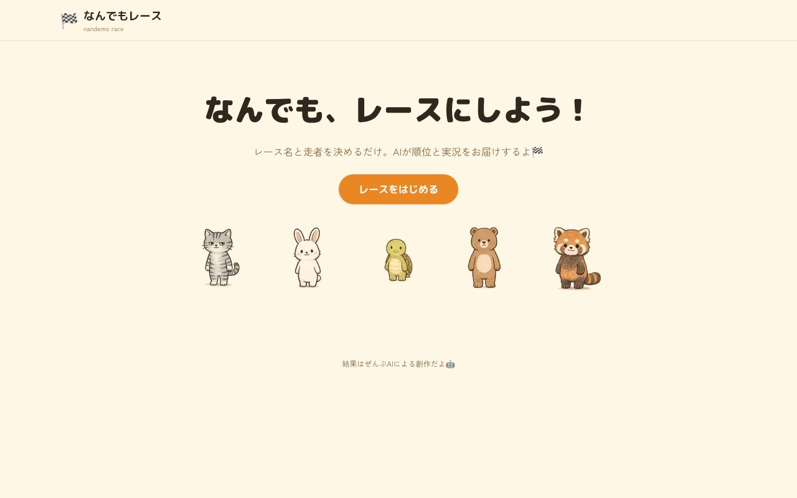

## どんなサービス？

「なんでもレース」は、レースの名前と走者（2〜5人）を入れるだけで、AIが順位と実況つきのレース展開を作ってくれる、遊びのWebアプリです。公式ページには、「なんでも、レースにしよう！」「結果はぜんぶAIによる創作だよ」と書かれています。

開発者によると、「結婚レース」「ダイエットレース」「出世レース」のように、日常のあれこれをテーマにして楽しむ使い方を想定しているそうです。

*画像：なんでもレース公式サイト（2026年10月8日に取得）*

## 使い方

1. テーマ（レース名）と走者を入力する
2. 「レース開始」を押す
3. コース上をカートのキャラクターが走るアニメーションと一緒に、AIの実況が流れる
4. 結果のページで、表彰台、ランキング、ドラマのような出来事、総評を見る

実況は、生成が終わるのを待たずに、できた分から順に画面へ流れます。

## ここがポイント

- **結果はすべてAIの創作。** 実在の出来事や人物の評価ではなく、あくまで遊びとして作られています。
- **走者は自由に入力できる。** 友だちの名前や、好きなものの名前を入れて、盛り上がれます。
- **作った理由が気軽。** 開発者は、「AIのStructured Outputsで、おもちゃを作りたかっただけ」と書いています。

## リンク

- 開発者のX: [@dev_cat222](https://x.com/dev_cat222)
- サービス: [nandemo-race.vercel.app](https://nandemo-race.vercel.app/)
- 開発記（Qiita）: [レース名と走者を入れるとAIが実況してくれるだけのアプリを作った(Vercel AI SDK)](https://qiita.com/dev_cat222/items/d0ee696866f08f41228c)
