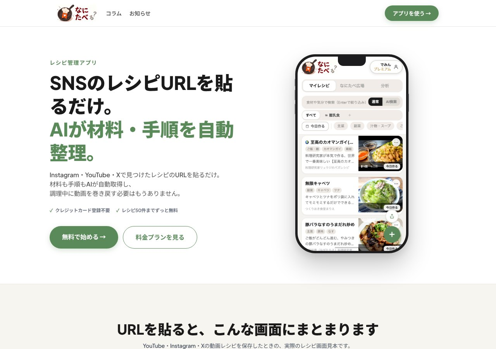

## どんなサービス？

「なにたべ」は、SNSで見つけたレシピを、URLを貼るだけで保存・整理できるレシピ管理アプリです。公式ページには、「Instagram・YouTube・Xで見つけたレシピのURLを貼るだけ。材料も手順もAIが自動取得し、調理中に動画を巻き戻す必要はもうありません」とあります。

クレジットカードの登録は不要で、レシピ50件までは、ずっと無料です（確認日：2026年10月8日）。

*画像：なにたべ公式サイト（2026年10月8日に取得）*

## できること

公式ページと開発記によると、次のような機能があります。

- X、Instagram、YouTube、クックパッドなどのURLを貼ると、材料・分量・手順が整理される
- 材料をタップして、買い物チェックができる
- 調理中は、画面の消灯を防ぐ表示ができる
- フォルダで整理できる（離乳食と普段のレシピを分けたい、という思いから）
- 詳細画面で、人数に合わせて分量を調整できる

## ここがポイント

- **自分の困りごとから作った。** SNSごとにバラバラに保存したレシピが、見つからなくなる。既存のアプリは、AIの回数制限がすぐ来る、特定のSNSで取れなくなる、といった点が不便だった、と開発記に書かれています。
- **非エンジニアがAIと作った。** 開発者は、コードを書いた経験がほとんどない状態から、Claudeと対話しながら作ったそうです。
- **料金プランも用意。** 無料枠を超えて使いたい場合は、料金プランがあります。

## リンク

- サービス: [なにたべ](https://nanitabe-ru.netlify.app/)
- 開発記（Zenn）: [技術知識のない自分がAIと一緒にレシピ管理アプリを作った話](https://zenn.dev/demin/articles/b76b2f98326cad)
