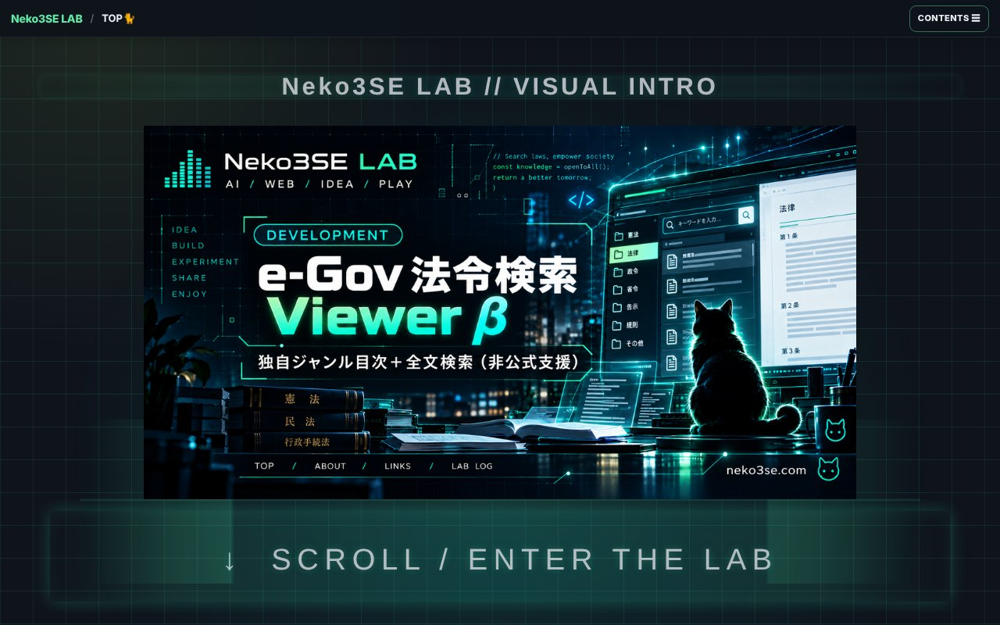
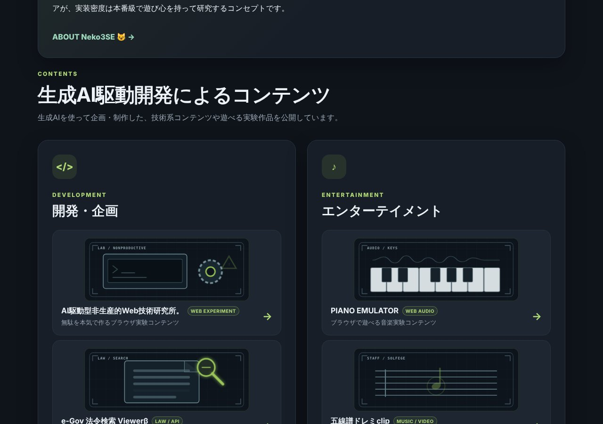

## どんなサービス？

「Neko3SE LAB」は、生成AIとWeb技術を使った実験コンテンツや、ツール、制作物を公開している、個人のWeb実験ラボです。運営者は、サイトで「心理学専攻の組み込みシステムエンジニア」と紹介されています。コンセプトは、「実装密度は本番級で、遊び心を持って研究する」ことです。

*画像：Neko3SE LAB公式サイト（2026年10月8日に取得）*

## どんな作品がある？

公式ページには、次のような作品が並んでいます。

- **AI駆動型非生産的Web技術研究所:** 「無駄を本気で作る」ブラウザ実験。ミニゲームが入っています
- **e-Gov 法令検索 Viewerβ:** ジャンルやキーワードから、法令を探せる閲覧支援ツール
- **PROMPT GENERATOR:** 構造化されたプロンプトを、簡単に作るツール
- **PRO IMAGE PROMPT LAB:** 画像生成のプロンプト設計を研究・実証する
- **DEVICE CAPABILITY LAB β:** ブラウザから見える端末の能力と、Web APIを、実機で調べる
- **PIANO EMULATOR:** ブラウザで遊べるピアノ
- **五線譜ドレミclip:** 五線譜の音符と、音階の発音を同期させるコンテンツ
- **VOICE CHANGER LAB β:** マイクの音声を、解析・録音・再生する
- **SOUND TUNER LAB β:** 楽器や声を、「音」として測る解析ツール

*画像：Neko3SE LAB公式サイトの作品一覧（2026年10月8日に取得）*

## ここがポイント

- **共通のテーマは「ブラウザで、どこまでできるか」。** 開発者の開発記によると、ジャンルを決めずに作り続けるうちに、ブラウザそのものを実験器具として使う、という考えに落ち着いたそうです。
- **くだらないものを、本気で作る。** 「絶対押すな」「定時退社DEFENSE」「本番サーバー神社」のようなミニゲームが、技術を試す入口になっています。
- **実機での確認を大事にしている。** マイクや音声を使う作品では、端末やブラウザによる挙動の差が大きく、PCだけでなく、実機で動くことまで確かめていると、開発記に書かれています。
- **制作記録も公開。** 「LAB LOG」に、技術メモや雑記が、時系列でまとめられています。

## リンク

- サービス: [neko3se.com](https://neko3se.com/)
- 開発記（Qiita）: [法律検索、ボイスチェンジャー、本番サーバー神社――個人Webラボを作ったら技術スタックが迷子になった](https://qiita.com/NEKO3SE/items/0c1b67990b112319375d)
