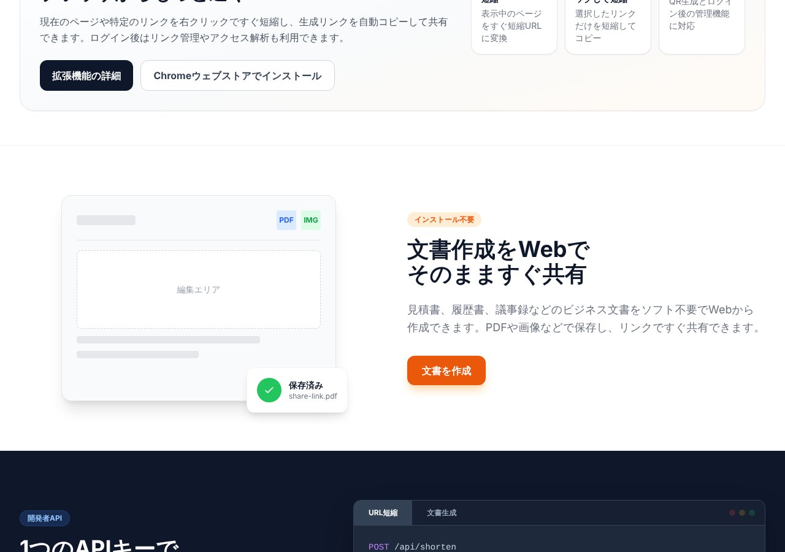

## どんなサービス？

「nly.kr」は、短縮URLの作成から、文書の作成・変換までを、ブラウザで行えるWebツールです。公式ページでは、「開発者とクリエイターのための、オールインワンWebツール」と紹介されています。

*画像：nly.kr公式サイト（2026年10月8日に取得）*

## できること

- **短縮URL:** 長いURLを短くします。国際化ドメイン（日本語や韓国語のドメイン）も、自動で変換して短縮できます。ログインすると、リンクの管理や、アクセスの統計（国、デバイス、OSなど）が使えます。QRコードの生成にも対応しています。
- **ドキュメント作成:** 見積書、履歴書、議事録などのビジネス文書を、ソフトなしでWebから作り、PDFや画像で保存して、リンクで共有できます。
- **Chrome拡張機能:** リンクを右クリックして短縮し、生成した短縮リンクを自動でコピーします。
- **開発者向けAPI:** 1つのAPIキーで、URL短縮とPDF文書の作成を、自動化できます。HTMLやテキストを送ると、PDFに変換して、ダウンロードリンクを返します。

*画像：nly.kr公式サイト（2026年10月8日に取得）*

## ここがポイント

- **セキュリティの配慮が公開されている。** 短縮サービスは、任意のURLに転送する仕組みのため、悪用されやすい性質があります。開発者は、転送先の検査、使えるURLの形式の制限、内部ネットワークへの転送の禁止、利用回数の制限などの対策を、開発記で説明しています。
- **ツールがまとまっている。** 短縮、PDF、拡張機能、APIが、同じアカウントで使えます。

## リンク

- 開発者のX: [@nly_kr](https://x.com/nly_kr)
- サービス: [nly.kr](https://nly.kr/ja/)
- 開発記（Qiita）: [URL短縮サービスを個人開発する時に考えたセキュリティ対策](https://qiita.com/nlykr/items/84adecac1ab84e468946)
