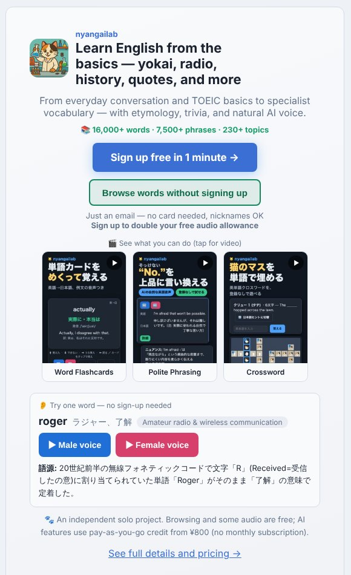

## どんなサービス？

「nyangailab」は、AIを使った英語学習アプリです。特徴は、月額のサブスクではなく、前払いのチャージ制であること。公式ページには、「無料で試せる、もっと使いたい人だけチャージ、使った分だけ消費」という流れが書かれています。

日常会話やTOEICから、妖怪、ラジオ、歴史、名言まで、幅広い単語やフレーズを収録しているのも特徴です。公式ページでは、1万6千語以上の単語、7千5百件以上のフレーズと紹介されています（確認日：2026年10月8日）。

*画像：nyangailab公式サイト（2026年10月8日に取得）*

## できること

- 単語とフレーズの学習、フラッシュカード、クイズ
- リーディング、ライティング、リスニング
- AIとの英会話（ハンズフリーで、会話の記録や要約もできる）
- ゲーム

登録しなくても、単語やフレーズの閲覧、フラッシュカード、無料範囲の音声再生は試せます。公式ページには、AIを使う機能は前払いのクレジットで、月額料金はない、と書かれています。料金の詳細は、公式ページの料金案内で確認してください。

## ここがポイント

- **「サブスク疲れ」から設計した。** 開発記によると、使うか分からないものに毎月払い続けるのがいやで、このモデルにしたそうです。
- **小さな構成で動かす。** FastAPIと素のHTML/CSS/JavaScript、SQLiteで作り、`python run.py` だけで動く構成を目指したと書かれています。
- **AIでコンテンツのコストを下げた。** 単語やフレーズの制作にAIを使い、低価格につなげています。

## リンク

- サービス: [nyangailab](https://study.nyangailab.com/)
- 開発記（Qiita）: [サブスク疲れで、使った分だけ払うAI英語学習アプリを個人開発して公開した話（①設計思想と技術構成編）](https://qiita.com/ytsuka015/items/3ab927096de7cb503930)
