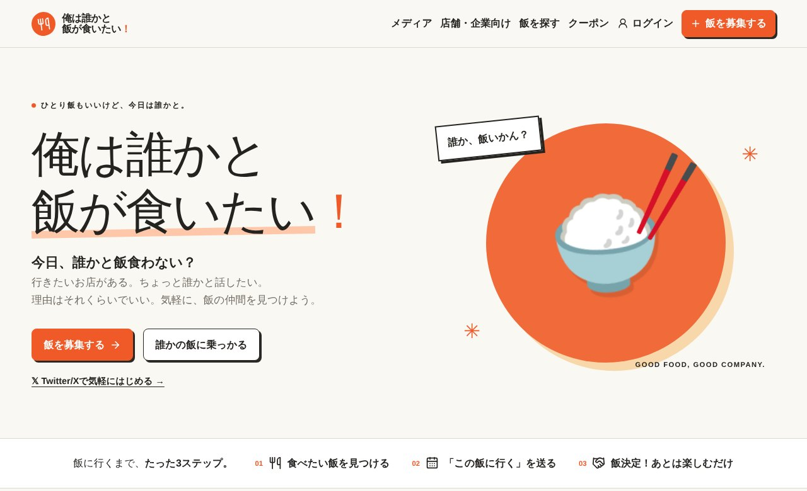

## どんなサービス？

「俺は誰かと飯が食いたい！」は、食事の相手を探すことだけに絞ったWebサービスです。公式ページの言葉は、「ひとり飯もいいけど、今日は誰かと。行きたいお店がある。ちょっと誰かと話したい。理由はそれくらいでいい」。

開発記では、マッチングアプリほど重くなく、SNSで「誰か飯行こ」と投稿するよりも少し具体的なもの、と説明されています。

*画像：俺は誰かと飯が食いたい！公式サイト（2026年10月8日に取得）*

## 使い方

公式ページには、「飯に行くまで、たった3ステップ」とあります。

1. 食べたい飯を見つける
2. 「この飯に行く」を送る
3. 飯決定！あとは楽しむだけ

自分で飯を募集することも、誰かの募集に乗っかることもできます。ログインは、X（Twitter）で気軽に始められます。募集には、場所、日時、人数、予算の目安などが載ります。

## ここがポイント

- **目的を絞っている。** 「飯を食う相手を探す」ことだけに特化しています。
- **店舗・企業向けの窓口もある。** メニューには、メディアや店舗・企業向けのページ、クーポンがあります。
- **リリース後の話も公開。** 開発記の後編では、公開しても人は来ない、という集客の壁にぶつかった経験と、通知基盤などの機能追加が書かれています。

*一覧に出る募集は利用者の投稿のため、紹介ページでは募集の画面は掲載していません。*

## リンク

- 開発者のX: [@kyuuka1228](https://x.com/kyuuka1228)
- サービス: [俺は誰かと飯が食いたい！](https://ore-meshi.com/)
- 開発記（Qiita）: [個人開発でサービスをリリースした。その後「人が来ない」という最大のバグに遭遇した話](https://qiita.com/kyubey1228/items/6ddc8cc04dadc48f35a5)
