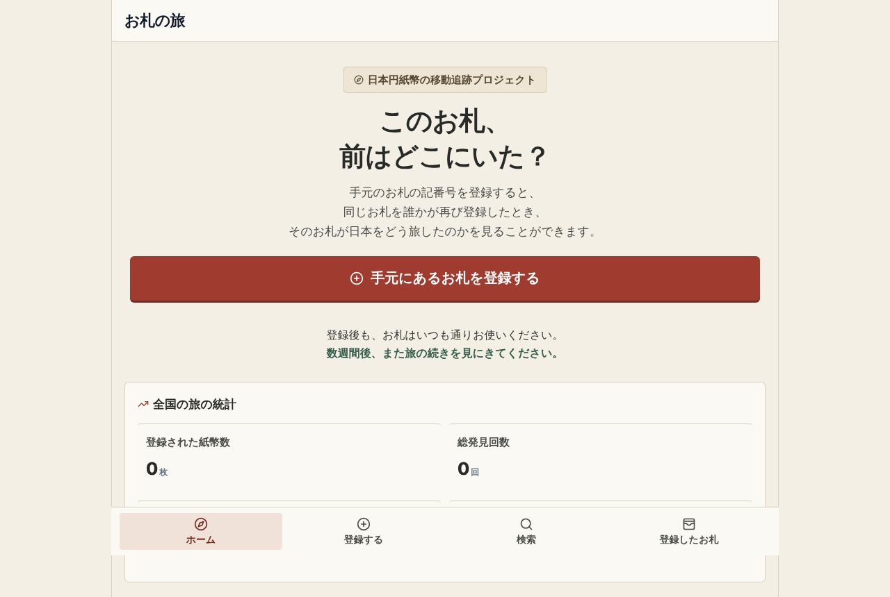

## どんなサービス？

「お札の旅」は、日本円の紙幣の移動を、みんなで追跡するプロジェクトです。手元のお札に印刷された記番号を登録し、同じお札を別の誰かが登録すると、そのお札が日本をどう旅したかが見られます。

アメリカで、紙幣の移動を追う「Where's George?」というサービスに着想を得て、日本版を作ったと、開発者の開発記に書かれています。公式ページでは、「自然に市中を流通している紙幣の偶然の再会を、みんなで見守る市民実験」と説明されています。

*画像：お札の旅公式サイト（2026年10月8日に取得）*

## 使い方

1. 財布に入っているお札の記番号を登録する
2. 今いる市区町村を記録する
3. そのお札は保管せず、いつも通り使う
4. 別の誰かが同じお札を手にして、再び登録する
5. 数週間後にサイトを見ると、そのお札の旅が進んでいるかもしれない

登録したお札が、別の場所で見つかると、トップページに「再発見」のお知らせが出ます。「札幌市から大分市へ」のように、直近の移動も表示されます。

## ここがポイント

- **お札には何も書かない。** お札へのペンでの書き込み、スタンプ、シールは、紙幣を傷め、法律やマナーに反するため、公式ページで厳禁と書かれています。
- **全国の統計が見られる。** 登録された紙幣の数、再発見の回数、最長の移動距離などが、トップに表示されます。
- **PCでもスマホでも使える。**

## リンク

- 開発者のX: [@bicycle_geek](https://x.com/bicycle_geek)
- サービス: [osatsu-no-tabi.ayago.workers.dev](https://osatsu-no-tabi.ayago.workers.dev/)
- 開発記（Qiita）: [日本版「Where's George?」を作った ― お札の記番号から旅を追いかける「お札の旅」](https://qiita.com/ayago/items/b7415bd196dc6a63d00f)
