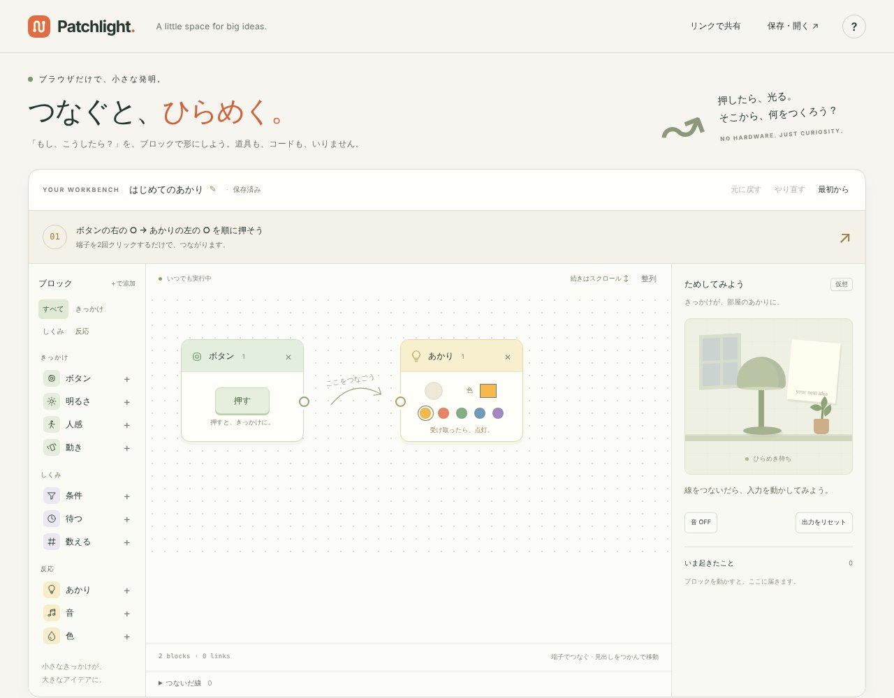

## どんなサービス？

「Patchlight」は、入力・処理・出力のブロックを自由に線でつなぐ、小さな工房です。公式ページには、「ブラウザだけで、小さな発明。つなぐと、ひらめく。『もし、こうしたら？』を、ブロックで形にしよう。道具も、コードも、いりません」と書かれています。

たとえば、ボタンを押すとあかりがつく。そこに「2回に1回」を挟むと、2回押して初めてつく。「待つ」を挟むと、少し遅れてつく。線を1本つなぐだけで、同じ操作の意味が変わります。

*画像：Patchlight公式サイト（2026年10月8日に取得）*

## 使い方

開発記によると、最初の画面には、まだつながっていない「ボタン」と「あかり」が置かれています。

1. ボタンの右側の出力端子を押す
2. あかりの左側の入力端子を押す
3. ボタンの「押す」を押す

つなぐ前は光らず、つなぐと信号が線を通って、あかりが点きます。実行ボタンはなく、押したその場で動きます。端子はキーボードでも操作できます。

ブロックは、「きっかけ」（ボタン、明るさ、人感、動き）、「しくみ」（条件、待つ、数える）、「反応」（あかり、音、色）に分かれています。作ったものは、リンクで共有できます。

## ここがポイント

- **実機は要らない。** センサーの値は、すべてブラウザ上の仮想の値です。
- **独立した教材。** Sony MESHの公式ツールではなく、独立した教材だと、開発記に明記されています。
- **「使い方を作る手」を渡す。** 仕組みを作って現場に渡す仕事をしてきた経験から、使い方を説明するのではなく、使い方を作る手を渡すことを、設計の土台にしたそうです。
- **ソースコードは公開。** 開発記からGitHubへのリンクがあります。

## リンク

- サービス: [Patchlight](https://hocky0301.github.io/patchlight/)
- 開発記（Zenn）: [実機がなくても、つないで作れる。ブラウザのブロック工房「Patchlight」を作った](https://zenn.dev/hocky3/articles/b5f99cf17aed34)
