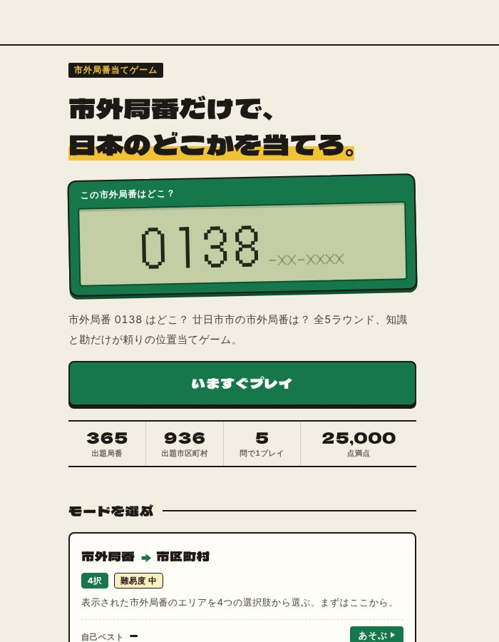

## どんなサービス？

「Phone Num Guessr」は、市外局番だけを手がかりに、日本のどこかを当てるブラウザゲームです。画面に「0138」と出たら、函館市。地図も検索も使わず、知識と勘で答えます。

1プレイは全5ラウンドで、正解の速さに応じて時間ボーナスが付き、満点は25,000点です。公式ページによると、出題されるのは365件の市外局番と936の市区町村です（確認日：2026年10月8日）。

*画像：Phone Num Guessr公式サイト（2026年10月8日に取得）*

## 4つのモード

公式ページには、「市外局番→市区町村」と「市区町村→市外局番」の2方向に、4択と自由回答の2形式を掛け合わせた、4つのモードがあると書かれています。

- 4択：制限時間は20秒
- 自由回答：制限時間は40秒。都道府県が合っていれば部分点がもらえる

上2桁が地方のヒントになる、という攻略のコツも、ページに載っています。

## ここがポイント

- **友だちに出題できる。** Xへの投稿、LINE、テキストのコピーで、結果を共有できます。
- **GeoGuessrの対策にも。** 公式ページでは、日本が出題された際に、看板などの電話番号から地域を絞る練習になると紹介されています。
- **4時間で公開。** 開発記によると、作業時間は合計4時間で、コードの大半はClaude Codeに書かせたそうです。題材選びと、データの整理（総務省の資料をもとにした出題データ）に力を入れた、と書かれています。

## リンク

- サービス: [Phone Num Guessr](https://pnumguess.yocto-works.com/)
- 開発記（Zenn）: [「0774ってどこ？」市外局番だけで日本のどこかを当てるゲームを、実作業4時間で公開した話](https://zenn.dev/blackmose/articles/c5eee066bc59e2)
