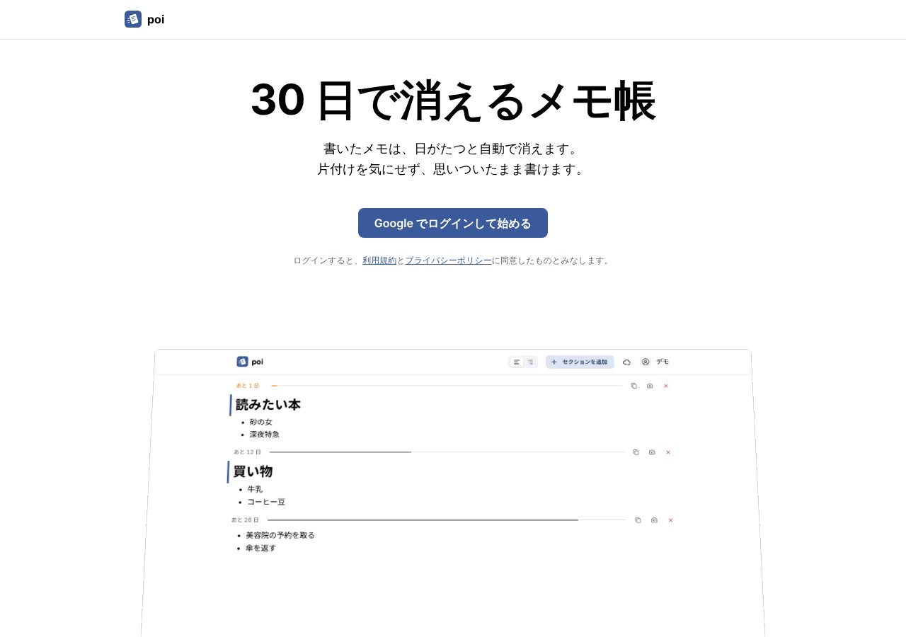

## どんなサービス？

「poi」は、書いたメモが30日たつと自動で消える、メモ帳です。公式ページには、「片付けを気にせず、思いついたまま書けます」と書かれています。Googleアカウントでログインすれば、すぐに書き始められます。

買い物リストや作業のログ、コピー＆ペーストの一時置き場。こうしたメモは数日後には用済みなのに、メモアプリに残り続けます。poiは、片付けをやめて、時間に任せることにしました。

*画像：poi公式サイト（2026年10月8日に取得）*

## できること

公式ページと開発記によると、次のような特徴があります。

- **書いてから30日で消える：** 保存期間は、1・3・7・14・30・60・90日から選べる
- **セクションごとに消える：** 空行2つで区切ったまとまりごとに、古いものから消える。残りの日数がバーで見えるので、消える前に気づける
- **見出しでまとめて読む：** 同じ見出しのメモを、日付をまたいで一か所に集めて表示できる
- **コピーも画像も、ワンクリック：** セクションごとに、テキストのコピーや画像化ができ、チャットやSNSに貼れる
- **ホーム画面に追加：** アプリのように使え、電波がないときも前回の内容は読める

## ここがポイント

- **期限は、直しても延びない。** 毎日少しずつ触るメモが、いつまでも消えなくなるのを避けるため、期限は書いたときに決まります。
- **1つのWorkerで動く。** Cloudflare Workersが画面とAPIの両方を返し、データはD1に置いています。期限切れのメモは、定期実行で消します。
- **MITライセンスで公開。** コードはGitHubで公開されています。

## リンク

- サービス: [poi](https://poinote.app/)
- 開発記（Zenn）: [書いたメモが30日で消えるメモ帳を、Cloudflare Workers 1つで作った](https://zenn.dev/884naoki/articles/a0790120fe713c)
