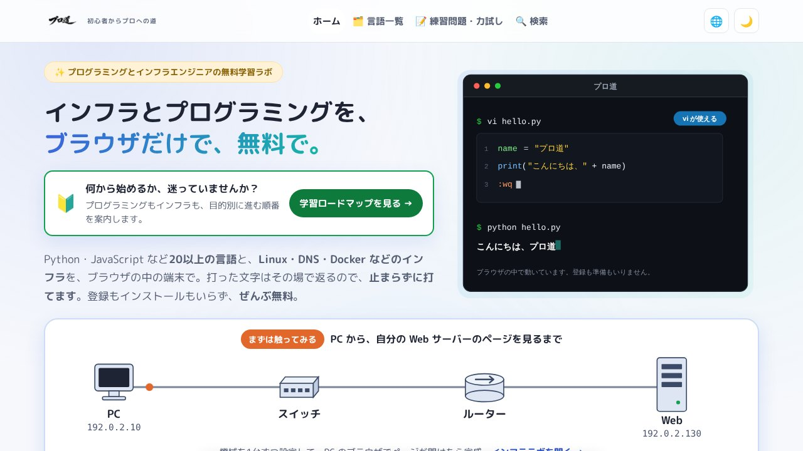

## どんなサービス？

「プロ道」は、ITインフラとプログラミングを、ブラウザだけで学べる無料の学習サイトです。Linux・Git・Docker・AWSなど、練習で自分のパソコンを壊すのが不安なコマンド操作を、安全に試せることを売りにしています。

公式ページによると、登録もインストールも不要で、完全に無料です。

*画像：プロ道公式サイト（2026年10月7日に取得）*

## 何が学べる？

- **インフラ:** Linux、DNS、Docker、AWS、Terraform、Ciscoのネットワーク機器など
- **プログラミング:** 20以上の言語に対応し、Web開発、アプリ開発、データ・システム系に分かれている
- **インフララボ:** ネットワーク構成図を自分で組んで、実習できる

*画像：プロ道公式サイトのインフララボ（2026年10月7日に取得）*

## ここがポイント

- **疑似ターミナル。** 打ったコマンドに対して、用意したシナリオに沿った応答を返す仕組みです。実機や仮想マシンを用意する必要がありません。
- **コードもブラウザの中で動く。** コードは、サーバーに送られずにブラウザ内で実行されると、公式ページに書かれています。
- **アプリのように使える。** PWAに対応していて、ホーム画面に追加できます。
- **小学生向けのコンテンツもある。** 「プロ道キッズ」というコーナーがあります。

## リンク

- 開発者のX: [@GOISBLOG](https://x.com/GOISBLOG)
- サービス: [prodou.net](https://prodou.net/)
- 開発記（Qiita）: [個人開発でインフラ特化のプログラミング学習サイトを作った話](https://qiita.com/genhiroko/items/5bd826b27506a0cf8bf2)

*数字は、確認日時点の公式ページの表記です。*
