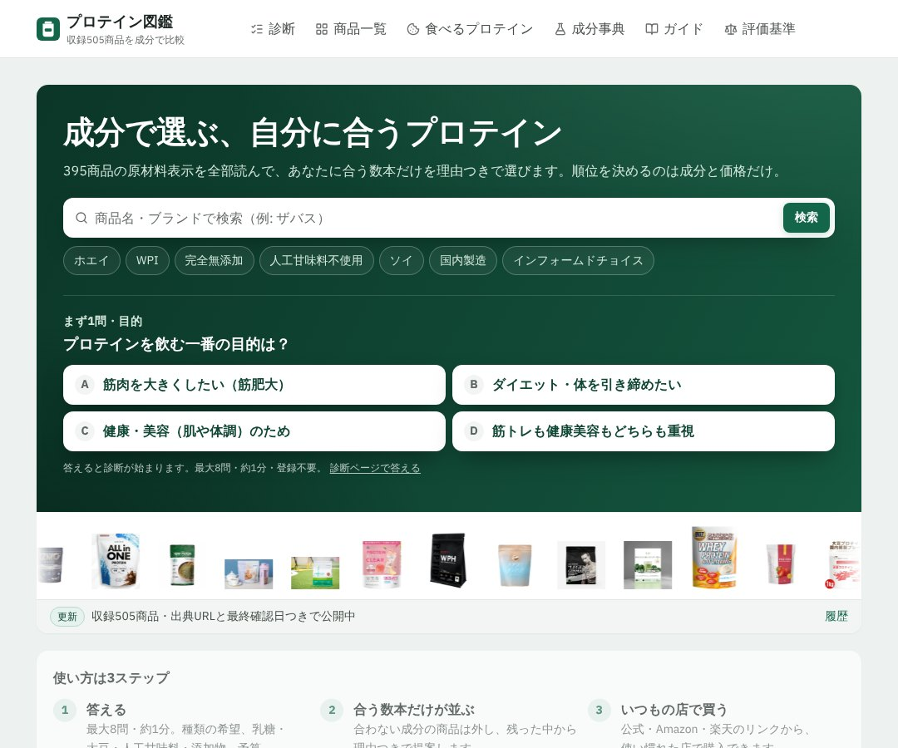

## どんなサービス？

「プロテイン図鑑」は、プロテインを成分と価格で比べて選ぶ、比較サイトです。公式ページには「順位を決めるのは成分と価格だけ」と書かれていて、広告や提携の有無は、収録・診断・並び順に影響しない、と説明されています。

トップには「収録505商品を成分で比較」とあります（確認日：2026年10月8日）。

*画像：プロテイン図鑑公式サイト（2026年10月8日に取得）*

## できること

開発記と公式ページによると、入口は3つです。

- **診断：** 最大8問・約1分・登録不要。乳製品、人工甘味料、大豆アレルギーなどは「除外条件」として扱い、目的・味・予算は加点で評価する
- **一覧の絞り込み：** 種類、甘味料、たんぱく質含有率、乳糖、製造国、10gあたり価格などの軸で絞る
- **商品ページ：** 原材料表示の全文、栄養成分、出典URLと最終確認日を載せた「スペック表」

## ここがポイント

- **出典と確認日つき。** 公式ページに、原材料表示は全文を転記し、出典と最終確認日を全商品に載せていると書かれています。
- **条件を緩めない。** 開発記によると、条件に合う商品が1本しかなければ1本と表示し、アレルギー条件だけは、0件になっても緩和しません。
- **固定費0円の構成。** Next.jsの静的書き出しをCloudflare Pagesの無料プランに載せています。
- **広告について。** 商品リンクにはアフィリエイトが含まれることが、公式ページに示されています。

## リンク

- サービス: [プロテイン図鑑](https://protein-zukan.com/)
- 開発記（Zenn）: [プロテイン400商品以上を"スペック表"で選べるサイトを固定費0円で作った](https://zenn.dev/m0t0taka/articles/03e95d434d9937)
