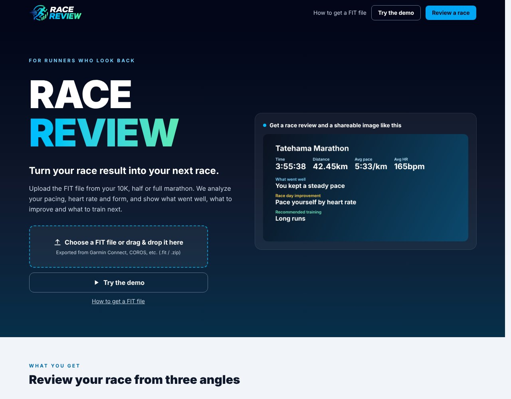

## どんなサービス？

「RACE REVIEW」は、マラソン大会の記録（FITファイル）をアップロードすると、レースの振り返りと次の練習を提案してくれる、Webサービスです。公式ページのキャッチコピーは、「Turn your race result into your next race（レースの結果を、次のレースに）」。対象は、10km、ハーフ、フルマラソンです。

ペース配分、心拍、フォーム（ピッチ・ストライド）を分析して、「良かった点」「レース当日の改善点」「おすすめの練習」の3つの角度から返します。

*画像：RACE REVIEW公式サイト（2026年10月8日に取得）。画面のレース結果はサンプルです。*

## 使い方

- GarminやCOROSなどのアプリから、レースのFITファイルを書き出す
- ファイルを選ぶか、ドラッグ＆ドロップする（ログイン不要）
- 結果を見て、シェア用の画像も作れる

ファイルを持っていない人向けに、デモも用意されています。

## ここがポイント

- **ファイルは端末の外に出ない。** 開発記によると、FITファイルはブラウザの中で処理され、サーバーには送られません。
- **文章生成AIは使っていない。** 判定にはTypeSafe社のモデル「Jev」を使い、文章はテンプレートに数値を差し込んで作っています。
- **作った理由。** 大会の後にグラフを眺めても、次に何をすればいいかは自分で考えるしかない。振り返りから次の練習までを示してくれるアプリがほしかった、と書かれています。

Apple Watchのワークアウトは、標準の機能ではFITファイルとして書き出せません（開発記より）。

## リンク

- サービス: [RACE REVIEW](https://race-review.ohsawa0515.workers.dev/)
- 開発記（Zenn）: [JevとCloudflare Workersで、FITファイルからマラソン大会を振り返るWebサービスを作った](https://zenn.dev/ohsawa0515/articles/race-review-jev-cloudflare)
