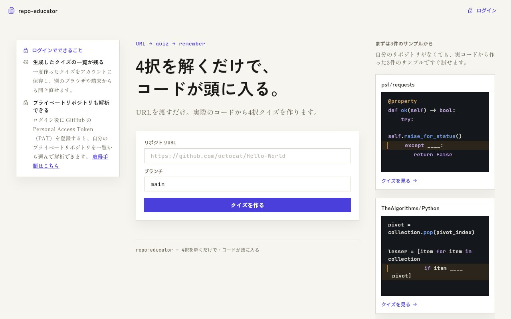

## どんなサービス？

「repo-educator」は、GitHubのリポジトリのURLを渡すと、実際のコードから4択クイズを作ってくれるWebサービスです。公式ページには、「4択を解くだけで、コードが頭に入る。」と書かれています。

新しいリポジトリに入ったとき、READMEを読み、`main` を探して、なんとなく分かった気になって、次の日には忘れている。その「読んだ気になる」を、「答えられる」に変えたくて作ったと、開発者は書いています。

*画像：repo-educator公式サイト（2026年10月8日に取得）*

## できること

- **穴埋め4択クイズ:** リポジトリのソースから、コードの一部を `?` に置き換えた4択問題を作ります。問題には「この関数はリトライ処理の途中である」といった場面の説明がつき、回答すると解説が出ます。
- **逆引きドキュメント:** 同じソースから、機能名、関数・クラス名、やりたいこと、ファイル名の4つの切り口で引ける索引も作られます。
- **サンプルで試せる。** 自分のリポジトリがなくても、公開リポジトリのサンプルで、クイズを試せます。
- **ログインすると、** 学習の履歴が保存され、アクセストークン（PAT）を登録して、非公開のリポジトリも解析できます。

## ここがポイント

- **「何をしようとしているコードか」が分かっていないと選べない。** 選択肢は、そうなるようにプロンプトで工夫していると、開発記に書かれています。
- **公開リポジトリは、そのまま試せる。** ログインなしで始められます。
- **注意点。** 非公開のリポジトリを解析するには、GitHubのアクセストークンの登録が必要です。登録する前に、サービスの説明や、プライバシーに関する記載を、よく確認してください。

## リンク

- 開発者のX: [@ssuga620282](https://x.com/ssuga620282)
- サービス: [repo-educator.web.app](https://repo-educator.web.app/)
- 開発記（Qiita）: [GitHubリポジトリから4択クイズを生成するサービスを作った](https://qiita.com/SyogoSuganoya/items/ee0faa5a6ce7dcdfa66f)
