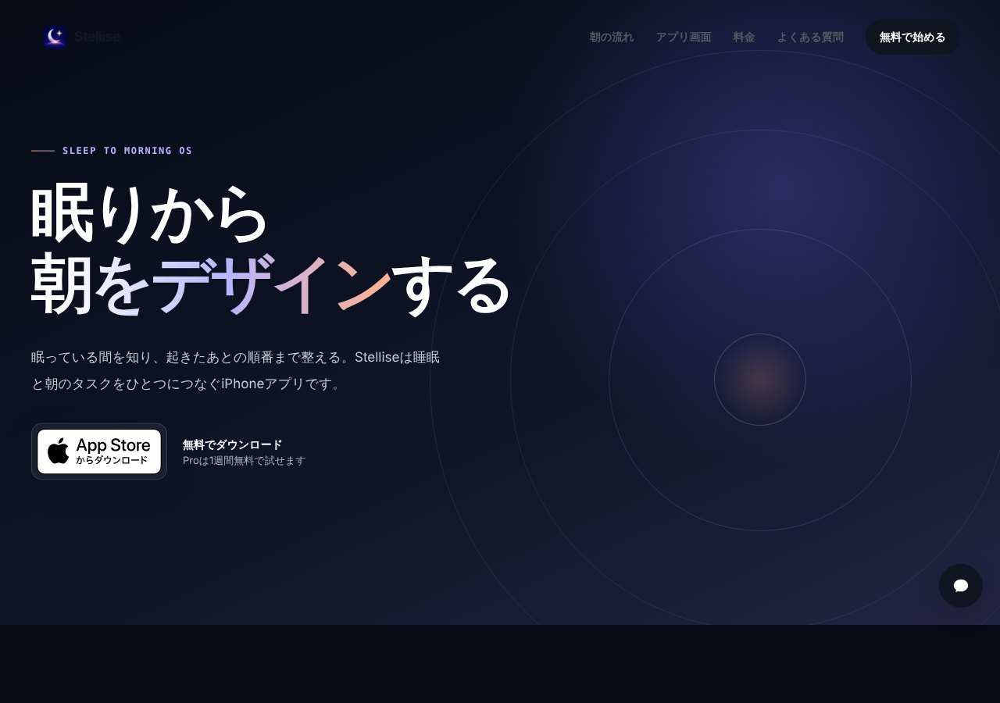

## どんなサービス？

「Stellise」は、睡眠と朝のタスクをひとつにつなぐ、iPhoneアプリです。公式ページのキャッチコピーは「眠りから、朝をデザインする」。眠っている間を知り、起きたあとの順番まで整える、と説明されています。

開発記によると、既存の目覚ましアプリの多くは、パズルを解かないと止められないというストレス方式。でも本当の問題は、起きた後に、天気や電車の遅れで何から手をつければ間に合うか分からなくなることにある、という考えから作られました。

*画像：Stellise公式サイト（2026年10月8日に取得）*

## できること

公式ページと開発記によると、次のような機能があります。

- **スマートアラーム：** 端末の中で睡眠状態を解析し、設定時刻の近くで起きやすいタイミングを探す
- **朝のタスクの組み直し：** 雨や電車の遅れに合わせて、出発時刻とやることの順番を再計算する
- **睡眠の振り返り：** スコアと1週間の変化を表示する。点数で責めず、傾向を見つける
- **夜のモード：** 眠る前に見る情報を少なく、起床までの時間とアラームを大きく表示

無料で始められ、Proの機能は1週間無料で試せます。無料版とPro版の違いは、公式ページの料金欄で確認できます（確認日：2026年10月8日）。

## ここがポイント

- **プライバシーを重視。** 睡眠の解析は、端末の中で行うと説明されています。
- **背景は画像ではない。** 開発記によると、背景は画像素材ではなく、SceneKitでリアルタイムに生成しています。
- **フィードバックを募集。** 開発記は、設計や使い心地について率直な意見がほしい、という呼びかけで書かれています。

## リンク

- サービス: [Stellise](https://stellise-app.com)
- 開発記（Zenn）: [【個人開発】睡眠×AI×天気連動の朝ルーティン最適化アプリ「Stellise」を作った。ダメ出し歓迎](https://zenn.dev/yuu_0617/articles/d9009f20d531ca)
