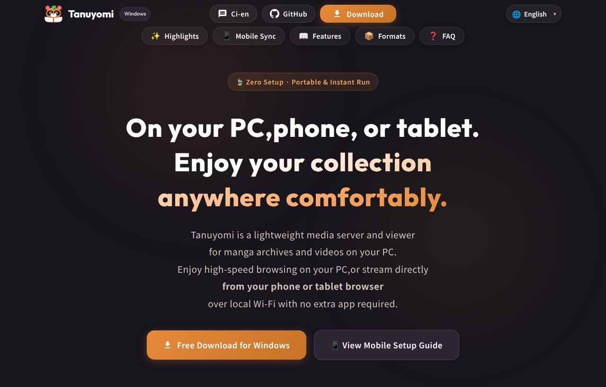

## どんなサービス？

「Tanuyomi」は、PCに保存したマンガのアーカイブや動画を、スマホやタブレットのブラウザから見るための、軽量なメディアサーバー兼ビューアです。公式ページには「PCでも、スマホでも、タブレットでも。あなたのコレクションを、どこでも快適に」とあります。

家のWi-Fiにつなぐだけで、専用アプリを入れなくても、ベッドやソファの上から見られます。Windows向けのアプリで、公式ページから無料でダウンロードできます（確認日：2026年10月8日）。

*画像：Tanuyomi公式サイト（2026年10月8日に取得）*

## できること

公式ページと開発記によると、特徴は次のとおりです。

- **スマホはブラウザだけ。** 専用アプリは不要で、同じWi-Fi内でスマホやタブレットのブラウザから開く
- **展開せずに読める。** ZIP、CBZ、PDFを、解凍せずにそのまま開く
- **サムネイルが速い。** 動画は100コマのサムネイルを作り、シークの目安にできる
- **導入が軽い。** 単一の実行ファイルで、DockerやWSLは要らない
- 日本語、英語、中国語（簡体字）の表示に対応

## ここがポイント

- **導入のハードルを下げた。** 開発記によると、既存のメディアサーバーは導入が重く、人におすすめしづらかったため、「ZIPを展開してEXEを叩くだけ」にしたそうです。
- **Blazor Serverで高速に。** .NET 10のBlazor ServerとSQLiteを使い、サムネイルやメタデータをキャッシュして、一覧や表示を速くしています。
- **CPU負荷に配慮。** 数千冊をスキャンしても閲覧が重くならないよう、バックグラウンド処理の負荷を調整する仕組みを入れていると書かれています。

自分のPCにあるファイルを見るためのツールです。ご利用の際は、各ファイルの権利や利用条件をご確認ください。

## リンク

- サービス: [Tanuyomi](https://nullponta.github.io/tanuyomi-website/)
- 開発記（Qiita）: [.NET 10 + Blazor Serverで、Docker不要・ZIP解凍だけで爆速動作する漫画＆動画メディアサーバーを作った話](https://qiita.com/nPonta/items/823411b4a2671876eb68)
