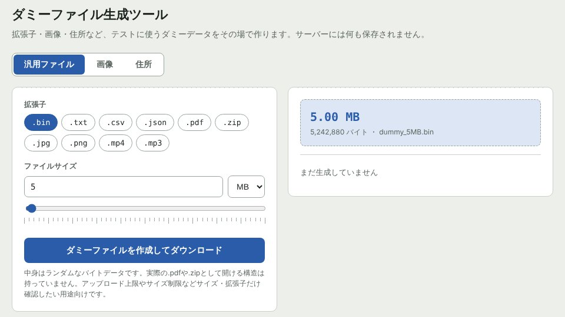

## どんなサービス？

「ダミーファイル生成ツール」は、テストに使うダミーファイルを、ブラウザの中で作れるWebツールです。公式ページには「拡張子・画像・住所など、テストに使うダミーデータをその場で作ります。サーバーには何も保存されません」と書かれています。

アップロード機能の確認のために、5MBや10MBのファイルがほしい。そんなとき、わざわざ探したり作ったりしなくて済むようにしたい、というのが作った理由だそうです。

*画像：ダミーファイル生成ツール公式サイト（2026年10月8日に取得）*

## できること

公式ページの説明によると、上のタブから3種類を選べます。

- **汎用ファイル**：.bin や .csv、.pdf、.zip などの拡張子と、ファイルサイズを指定して作る
- **画像**：サイズ（px）、形式、色を指定して作る
- **住所**：生成する件数とカラムを選んで、CSVにまとめる

使い方は、タブを選び、条件を決めて、ボタンを押すだけ。その場でダウンロードが始まります。

*画像：ダミーファイル生成ツール公式サイト（2026年10月8日に取得）*

## ここがポイント

- **使いどころが具体的。** アップロードのサイズ制限の確認、処理速度の検証、サムネイル生成のテスト、フォームやDBへの一括登録などが、公式ページに挙げられています。
- **中身はランダムなデータ。** 拡張子は付きますが、実際に開ける.pdfや.zipではない、と明記されています。サイズや拡張子の確認用です。
- **サーバーに送らない。** よくある質問に、生成はすべてブラウザの中で終わると書かれています。

## リンク

- サービス: [ダミーファイル生成ツール](https://www.testfilemaker.com/)
- 開発記（Qiita）: [テスト用のダミーファイル、いちいち作ってませんか？ブラウザだけで生成できるツールを作りました](https://qiita.com/yanabanapan/items/9ce1757e0f9a1d7d9fc4)
